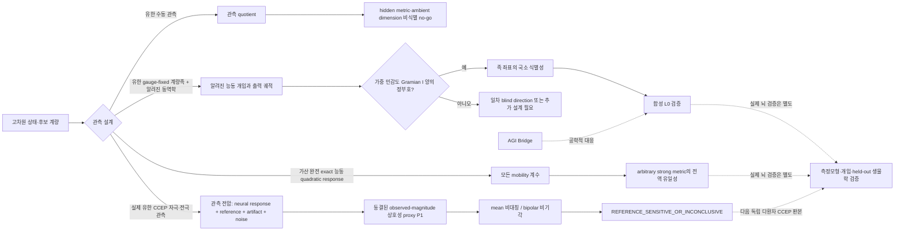

# CE-AGI Runtime: 뇌의 전기 동역학에서 현재 세계 모델까지

> 최신 상태: **유한 수동 관측의 metric 비식별 no-go, BA-OBS-ID1의 제한된 국소 식별성, BA-OBS-ID2의 가산 완전 exact-oracle 전역 식별 정리는 유지된다. 실제 인간 CCEP의 새 다환자 BA-OBS-DISC2R는 사전 고정한 관측 endpoint에서 단순 유클리드 거리 감쇠 `SC`를 환자-disjoint D0–D3에 걸쳐 통과시켰다.** D3의 평균 개선은 $0.0173522$, 97.5% participant-bootstrap 하한은 $0.0102676$, geometry permutation은 $p=1/4096$였고 matched prestimulus 대조는 통과하지 않았다. 이는 등록 좌표의 거리 항이 이 bipolar CCEP 관측 kernel 예측에 유익했다는 결과일 뿐, 뇌 metric·무한차원·의식·자아·해마 hash·AGI의 검증이나 반증이 아니다. 앞선 DISC1의 D2 음성 결과도 그대로 유지된다.

이 README의 중심 결론은 네 갈래를 함께 읽어야 한다는 것이다. 수동 EEG 같은 유한 관측은 주변 공간 전체의 계량이나 차원을 고르지 못한다. 사전 제한한 유한 계량족에서는 알려진 동역학·개입과 양의 정부호 Gramian 아래 국소 식별성이 가능하다. 더 강하게, 모든 basis 방향과 쌍 방향에 대한 exact 능동 응답을 가산히 완전하게 얻는 이상적 oracle에서는 임의 bounded strong metric도 전역적으로 정해진다. 마지막으로 실제 CCEP는 그 oracle을 흉내 내지 않고, 전극이 읽는 유한 응답 자체에서 훨씬 작은 상호성 필요조건만 시험했다. 이 네 결과는 서로 경쟁하지 않는다. 정보량과 측정모형이 달라질 때 어디까지 말할 수 있는지를 각각 제한한다.

이 저장소는 뇌가 정보를 전기적으로 전달하고, 과거를 품은 연결망 상태가 어떻게 하나의 행동 가능한 세계 모델을 만들 수 있는지 연구하는 CE-AGI runtime이다. 목표는 “의식이 무엇이다”라고 선언하는 일이 아니라, 생물 전기식에서 출발해 관측 가능한 예측까지 가는 식을 만들고 작은 반증 실험부터 통과시키는 일이다. 이 README는 먼저 직관을 잡고, 다음으로 수학의 각 기호가 무엇을 뜻하는지 설명하며, 마지막으로 현재 데이터가 어디에서 멈췄는지를 밝힌다.

프로젝트의 순서는 엄격하다. 이미 알려진 생물학적 전기 기전을 출발점으로 두고, 그 위에 제안 가설을 분리해 적고, EEG 같은 측정값이 실제로 무엇을 잃는지 모델링한 뒤, 작은 검증부터 독립적으로 진행한다. 아래 그림은 증명이나 생물학적 모형이 아니라, 수동 경로와 능동 식별 경로가 어떤 가정에서 갈라지는지 보이는 개념도다. 화살표는 뇌의 인과 법칙이나 의식의 증거를 뜻하지 않는다.

## 초록

뇌를 단일 숫자 가중치의 그래프가 아니라, 전압·이온 상태·시냅스의 과거 반응이 함께 변하는 동적 네트워크로 본다. 이 관점에서는 각 연결이 과거 입력에 반응하는 함수이므로 자연스러운 상태공간이 매우 고차원이고, 연속 과거를 보존하면 무한차원 힐베르트 공간으로 표현할 수 있다. 이 저장소는 그 공간 위에 후보 리만 계량을 정의하고, 사용자가 제안한 “여러 가능한 세계 가운데 하나가 지금-여기 세계로 특권화된다”는 생각을 별도의 미완성 가설로 다룬다.

그러나 세 가지를 구별해야 한다. 케이블 방정식과 전도도 기반 전류 보존은 생물물리의 출발 모형이고, 현재-세계 다양체는 아직 검증되지 않은 물리 사상이다. 유한 수동 EEG 관측이 뉴런별 간선이나 실제 계량을 직접 읽지 못하고 quotient만 정한다는 no-go는 증명되었다. gauge-fixed 유한 계량족·알려진 동역학·능동 개입·양의 정부호 Gramian 아래에서는 그 족 좌표의 국소 식별성이 가능하다. 그리고 가산 완전 exact 능동 response라는 훨씬 강한 공리 아래에서는 arbitrary bounded strong metric의 전역 유일성, 유한 section의 strong 수렴, weighted-Hilbert--Schmidt decay가 있을 때 noisy 오차 경계까지 증명되었다. 실제 뇌가 어느 가정을 만족하는지는 아직 모르며, 실제 EEG R0에서는 raw range·provenance 장치는 통과했지만 사전 고정한 작은 2차원 선형 $M_0$의 scientific baseline gate가 persistence를 이기지 못했다. 이 결과는 전기식이나 의식 가설의 반증이 아니라, 그들을 너무 거칠게 줄인 기준식의 실패다.

## 질문과 출발점

한 해 전에 이 문제를 처음 배운 독자라면 먼저 이렇게 생각하면 된다. 뉴런은 전압차가 있으면 전류를 주고받고, 연결의 세기와 반응성은 과거 스파이크·전압·화학 상태에 따라 달라진다. 따라서 뇌 상태는 지금 켜진 뉴런 목록이 아니라, 지금의 전기 상태와 아직 사라지지 않은 과거의 흔적을 함께 가진 대상이다. 이 저장소의 첫 질문은 그 대상을 어떤 식으로 써야 하는가이다. 두 번째 질문은 그 식의 어떤 부분이 EEG로 시험 가능한가이다.

의식에 관한 질문은 이보다 한 단계 뒤에 둔다. 정상 각성에서 우리는 기억, 상상, 미래 계획을 동시에 접근할 수 있어도 그 전부를 현재라고 경험하지 않는다. 여기서는 이 비대칭을 가능한 세계 후보들 가운데 하나가 NOW/HERE 특권을 얻는 과정으로 표현해 본다. 이는 매력적인 설명 후보지만 현재 관측으로 확정한 뇌 기전이 아니다.

## 도시·지도·교통의 비유

뇌를 거대한 도시로 비유해 보자. 건물은 뉴런, 길은 시냅스와 축삭, 길 위의 차량 흐름은 전류와 스파이크에 대응한다. 이 비유에서 중요한 점은 길 하나가 단순한 숫자 $W_{ij}$가 아니라는 데 있다. 비가 왔는지, 조금 전 교통량이 컸는지, 신호가 어떻게 바뀌었는지에 따라 같은 길도 통과 속도와 용량이 달라진다. 그래서 도시의 현재 상태를 알려면 현재 차 위치만이 아니라, 아직 교통에 영향을 주는 최근 사건의 기록도 알아야 한다.

지도 비유는 계량을 설명한다. 지도 위의 두 장소가 종이에서는 가까워도, 공사·일방통행·혼잡 때문에 실제 이동에는 멀 수 있다. 리만 계량은 상태공간에서 이 기능적 거리를 정하는 규칙 후보다. 현재 감각, 신체 상태, 최근 기억, 즉시 가능한 행동이 서로 빠르게 영향을 주면 이들은 기능적으로 가까운 영역을 만들 수 있다. 반면 오래된 학교나 상상한 화성은 표현되어 있어도 현재 행동 제어와의 기능적 거리가 클 수 있다.

교통 비유는 여기서 멈춘다. 뉴런에는 지도 관리자나 고정된 도로망이 없고, 전기장·세포 종류·비선형 이온 통로·다중 시간척도가 있다. 또한 지도상의 거리와 주관적 경험의 거리는 같은 물리량이라고 알려져 있지 않다. 비유는 왜 history와 계량을 도입하는지 돕지만, 의식을 증명하지 않는다.

## 무엇이 확립되었고 무엇이 가설인가

이 프로젝트는 한 식에 모든 뜻을 섞지 않는다. 생물 전기 기전, CE의 추가 가설, 측정 모형, AGI 구현을 층으로 나누면 실패가 났을 때 어느 층을 고쳐야 할지 알 수 있다.

| 층 | 이 README에서의 역할 | 현재 지위 |
|---|---|---|
| 생물 전기식 | 전류 보존과 전압 변화의 출발점 | 확립된 기전의 출발 모형 |
| CE 가설 | history 상태, 후보 계량, 현재-세계 특권화 | 공리: 물리 사상, 미완성 |
| 측정 모형 | 숨은 뇌 상태에서 EEG로 가는 관측 연산 | 식별 한계를 가진 필요 단계 |
| AGI Bridge | 같은 계산 구조를 가진 소프트웨어 설계 | 뇌 동일성 주장이 아닌 공학적 대응 |

이 층분리는 말의 강도를 제한한다. 실제 데이터에서 어떤 예측이 맞더라도 바로 뇌가 이 방식으로 작동한다고 말할 수는 없다. 개입 자료까지 포함한 높은 증거 단계 L4 전에는 그런 문장을 금지한다. 합성 시뮬레이터에서의 AGI 성과는 L0, 즉 구현이 그 계산을 수행했다는 수준이다.

## 전기적 출발 모형

뉴런 $i$의 막전압을 $V_i(t)$, 막 정전용량을 $C_i$라고 쓰자. $w_i$는 이온 통로의 gate 상태, $I_{\mathrm{ext},i}$는 외부 입력이고, $h_t$는 $t$ 이전의 관련 기록이다. Gap junction과 화학 시냅스는 구동 전압이 다르므로 먼저 분리한다.

$$
I_{ij}^{\mathrm{gap}}
=g_{ij}^{\mathrm{gap}}[h_t](V_j-V_i),
\qquad
I_{ij}^{\mathrm{chem}}
=\bar g_{ij}^{\mathrm{chem}}s_{ij}[h_t](E_{ij}-V_i).
$$

$E_{ij}$는 화학 시냅스의 reversal potential이고, $\bar g_{ij}^{\mathrm{chem}}$은 기준 전도도, $s_{ij}$는 transmitter와 수용체의 과거 상태를 요약한 무차원 개방 변수다. 이 둘을 합친 가장 간결한 전류 보존 출발식은 다음과 같다.

$$
C_i\frac{dV_i}{dt}
= \sum_j\left(I_{ij}^{\mathrm{gap}}+I_{ij}^{\mathrm{chem}}\right)
- I_{\mathrm{ion},i}(V_i,w_i)
+ I_{\mathrm{ext},i}(t).
$$

왼쪽은 전압을 바꾸는 데 필요한 전류다. $C_i$의 단위는 패럿(F), $dV_i/dt$의 단위는 V/s이므로 곱은 암페어(A)가 된다. 오른쪽의 각 항도 전류(A)여야 한다. 전도도 $g_{ij}$는 지멘스(S), 각 구동 전압은 V이므로 두 시냅스 전류 역시 A다. 이 단위 점검은 멋있어 보이는 항을 아무 단위로나 더하는 실수를 막는다.

긴 가지돌기를 공간적으로 풀려면 케이블 방정식의 꼴도 쓸 수 있다.

$$
c_m\frac{\partial V}{\partial t}
= \frac{1}{r_a}\frac{\partial^2 V}{\partial x^2}
- i_{\mathrm{ion}}(V,w)
+ i_{\mathrm{syn}}(x,t)+i_{\mathrm{ext}}(x,t).
$$

여기서 $x$는 한 가지돌기를 따른 위치이고, $c_m$은 길이당 막 정전용량, $r_a$는 축방향 저항, $i$들은 길이당 전류다. 이 PDE는 전압이 직선으로 번진다는 식이 아니라, 확산·누설·이온 비선형성·시냅스 입력이 함께 전파를 정한다는 최소 표현이다. 그래도 이것은 뇌 전체를 완결하는 식이 아니다. 세포 종류, 삼차원 형태, glia, 혈류, 관측 장치까지 모두 이 한 줄에 담기는 것은 아니다.

## 과거를 품은 상태공간

시냅스가 과거에 반응한다면 $g_{ij}$는 단일 상수가 아니라 history $h_t$의 함수가 된다. 예를 들어 지수적으로 오래된 과거를 약하게 만드는 가중치 $\rho$ 아래, 다음 상태공간을 후보로 둘 수 있다.

$$
\mathcal H
= \mathbb R^{N_V+N_w}
\times \bigoplus_{e} L^2_\rho(( -\infty,0]).
$$

앞 항은 현재의 전압과 이온 gate를, 각 $L^2_\rho$ 항은 간선 $e$에 붙은 과거 함수의 제곱적분 가능한 기록을 뜻한다. 물리 시간 $\theta$를 그대로 쓰면 $\rho(\theta)d\theta$가 무차원이 되도록 정하고, 아니면 기준 시간 $\tau_0$로 $\bar\theta=\theta/\tau_0$를 먼저 만든다. 이 공간이 무한차원인 이유는 과거를 유한 개 숫자로 잘라 저장하지 않고 연속 함수 전체로 보존하기 때문이다. 무한차원은 무한히 많은 뉴런이 있다는 뜻이 아니라, 함수 하나를 지정하려면 원칙상 무한히 많은 자유도가 필요하다는 뜻이다.

다만 fading memory, 즉 아주 오래된 기록의 영향이 줄어든다는 가정과 이 공간에 매끄러운 구조가 있다는 가정은 추가 선택이다. 데이터가 history의 어느 부분을 보존하는지, 어떤 $\rho$가 맞는지는 아직 결정되지 않았다. 무한차원 표기는 설명의 출발점이지 식별된 뇌 좌표계가 아니다.

## 후보 리만 계량과 방향성

상태 $x\in\mathcal H$에서 작은 변화 $u,v$의 기능적 길이와 각도를 정하려면 다음 꼴의 연산자 계량을 후보로 둘 수 있다.

$$
A_x=A_{0,x}+\sum_e D_e^*K_e(x)D_e,
\qquad
g_x(u,v)=\langle u,A_xv\rangle_{\mathcal H}.
$$

여기서 $D_e$는 간선 $e$의 변화·지연·필터 같은 국소 차이를 뽑는 연산자이고, $K_e$는 그 차이에 부여하는 가중 연산자다. $A_x$가 매끄럽고, self-adjoint이며, coercive하고 bounded라는 조건 아래 $g_x$는 길이를 음수가 되지 않게 측정하는 후보가 된다. 다시 말해 완전히 다른 상태는 멀고, 현재 기능에 민감하게 연결된 변화는 가까울 수 있도록 정한다.

리만 계량은 대칭이다. 따라서 $u$에서 $v$로의 길이는 $v$에서 $u$로의 길이와 같게 취급한다. 실제 신경 연결은 방향성을 가지므로 그 비대칭은 계량에 억지로 넣지 않고, 전류식의 흐름이나 생성자 $F(x,h_t)$에 둔다. 계량은 무엇이 가까운가를, 흐름은 어디로 시간이 진행하는가를 맡는다. 이 분리는 수학적 편의이면서 생물적 비대칭을 감추지 않기 위한 선택이다.

## 현재 세계의 특권화 가설

사용자가 제안한 중심 생각은 다음과 같이 읽을 수 있다. 뇌의 숨은 상태는 고차원일 수 있지만, 경험되는 세계는 매 순간 하나의 일관된 시공간적 조직을 우세하게 유지한다. 여기서 3+1은 신경 상태 다양체의 차원을 고정하는 말이 아니다. 선택된 세계모델이 표현하는 공간·시간 구조의 후보다. 신경 상태 자체의 차원은 훨씬 크거나 history 때문에 무한차원일 수 있다.

**[공리: 물리 사상] [미완성]** 시간 $t$에 가능한 세계 표현 후보를 $M_k(t)$로 두고, 감각·신체·시간·상충 비용을 모두 무차원화한 뒤 다음 에너지를 정의해 보자. 여기서 $M_k$라는 표기는 manifold 후보를 뜻할 뿐, chart와 국소 차원이 이미 존재한다는 주장이 아니다.

$$
E_k
=\lambda_sD_{\mathrm{sens},k}
+\lambda_bD_{\mathrm{body},k}
+\lambda_\tau D_{\mathrm{time},k}
+\lambda_cD_{\mathrm{conflict},k}.
$$

여기서 $D_{\mathrm{sens}}$는 감각 입력과의 어긋남, $D_{\mathrm{body}}$는 신체 위치·행동 가능성과의 어긋남, $D_{\mathrm{time}}$은 직전 시간과의 연속성 위반, $D_{\mathrm{conflict}}$는 후보들 사이의 양립 불가를 나타내는 비용 후보다. $\lambda$와 온도 $T$가 모두 무차원이라는 정규화가 선행되어야 지수 함수의 인자가 의미를 갖는다.

$$
\pi_k(t)=\frac{\exp(-E_k/T)}{\sum_\ell\exp(-E_\ell/T)},
\qquad
k^*(t)=\operatorname*{argmax}_k\pi_k(t),
\qquad
M_{\mathrm{present}}(t)=M_{k^*}(t).
$$

가장 우세한 후보와 두 번째 후보의 차이는 현재성의 단순 지표 후보로 쓸 수 있다.

$$
\Gamma(t)=\log\frac{\pi_{(1)}(t)+\varepsilon}
{\pi_{(2)}(t)+\varepsilon}.
$$

$\Gamma$가 크면 이 정의 아래 한 후보가 다른 후보보다 강하게 특권화되었다는 뜻일 뿐, 주관적 의식의 크기를 측정했다는 뜻은 아니다. 기억은 과거 태그가 강한 후보, 상상은 감각 anchor가 약한 반사실 후보, 꿈은 외부 감각 anchor가 약한 내부 생성 후보로 비유할 수 있다. 이 비유도 기억·상상·꿈의 신경 기전을 설명한 결과는 아니다.

위 식의 $\varepsilon>0$은 무차원 수치 안정화 상수다. 확률 $\pi_k$, $\varepsilon$와 그 비율이 모두 무차원이므로 로그를 취할 수 있다.

국소적으로 현재 세계 쪽 변화와 그 밖의 변화를 다르게 재는 단순 계량은 다음처럼 쓸 수 있다.

$$
g_x(u,u)=a\lVert P_*u\rVert^2
+b\lVert(I-P_*)u\rVert^2,
\qquad 0<a<b.
$$

$P_*$는 기준 힐베르트 내적에서 선택 후보의 접공간 쪽 성분을 뽑는 직교 사영 후보다. 정규화된 local chart에서 $a,b$는 양의 무차원 계수다. $a<b$이면 같은 크기의 변화라도 현재-세계 방향은 더 짧게, 밖의 변화는 더 길게 측정한다. 이것은 metric concentration을 설명하는 local model이지, 실제 뇌에서 계수나 사영을 측정한 식이 아니다.

다양체의 수학적 차원은 정수다. 반면 관측 스펙트럼의 유효차원은 연속값일 수 있다. 예컨대 고유값 비율에서 얻은 확률 $p_r$로

$$
d_{\mathrm{eff}}=\exp\left(-\sum_r p_r\log p_r\right)
$$

를 정의하면 $d_{\mathrm{eff}}$는 정수가 아닐 수 있다. 이것을 의식이 4가 아닌 연속 차원이라고 부르면 서로 다른 개념을 섞게 된다. 반복 loop의 존재도 rank 4를 강제하지 않으므로, 고정 차원 주장은 사전 고정한 차원 sweep과 독립 자료를 통과해야 한다.

## 해마를 해시로 보는 비유

해마가 빠른 주소 지정에 관여한다는 생각은, literal cryptographic hash가 아니라 희소한 주소 후보로 표현할 수 있다. 아래 선형합에 들어가는 $z,c,\tau$와 문턱은 각각의 기준 척도로 먼저 무차원화한다.

$$
h=\operatorname{Sparse}_s(B_zz+B_cc+B_\tau\tau-\vartheta).
$$

$z$는 현재 표현, $c$는 문맥, $\tau$는 시간 단서, $\vartheta$는 활성화 문턱이다. 이 식은 적은 수의 주소 성분이 활성화되어 기억 후보를 빨리 찾는다는 공학적 비유를 만든다. 해마가 정보를 새로 만들거나, 고차원 상태를 4차원 bottleneck으로 정확히 복원한다는 뜻은 아니다. 실제 해마의 표상과 이 식의 대응은 별도의 실험 문제다.

## EEG는 무엇을 보고 무엇을 잃는가

실제 기록은 숨은 상태 $q_t$를 직접 주지 않는다. 관측 $y_k$는 대략 다음처럼 쓴다.

$$
y_k=\mathcal O(q_{t_k})+\epsilon_k.
$$

$\mathcal O$에는 두피까지의 전도, 센서 배치, 기준전극, 필터와 전처리가 들어가고, $\epsilon_k$에는 잡음과 모델에 적지 않은 오차가 들어간다. 따라서 두피 EEG는 수많은 숨은 상태 중 같은 기록을 만드는 상태를 구별할 수 없다. 관측 kernel을 나눈 quotient만 볼 뿐이며, 뉴런 간선 하나의 전도도, 실제 리만 계량, 혹은 현재 세계 후보를 식별하지 못한다.

이 한계는 path와 self에도 적용된다. 유한한 history feature는 상태를 확장하면 순간 상태의 일부로 다시 표현할 수 있다. 그러므로 path 항이 기준선보다 예측을 개선하더라도 자아는 존재론적으로 path라는 결론은 나오지 않는다. 개선은 모델 비교의 결과일 뿐 존재론의 증명은 아니다.

### 닫힌 수학적 경계: 유한 관측 metric no-go

위의 “quotient만 본다”는 문장은 이제 명시적인 조건부 정리로 닫혀 있다. 무한차원 실 Hilbert 상태공간 $\mathcal H$에서 무차원화된 $r$차원 관측 map의 미분을 $J_q=D\mathcal O_q$라 하고, 관측 정밀도 $W\succ0$를 두면 관측 pullback은

$$
g_q^{\mathrm{obs}}(u,v)
=\langle J_qu,WJ_qv\rangle
$$

이다. 양의 정부호인 $W$ 때문에 다음이 성립한다.

$$
\ker g_q^{\mathrm{obs}}=\ker J_q,
\qquad
\operatorname{rank}g_q^{\mathrm{obs}}
=\operatorname{rank}J_q\le r.
$$

$\mathcal H$는 무한차원인데 $r$은 유한하므로 관측 kernel은 무한차원이다. 따라서 $g_q^{\mathrm{obs}}$는 전체 $\mathcal H$의 coercive Riemann metric일 수 없고, $\mathcal H/\ker J_q$의 pointwise quotient inner product만 정한다.

비식별성은 단순한 rank 계산보다 강하다. $K=\ker J_q$, $X=K^\perp$, $B=J_X^*WJ_X$라 하고

$$
G_\alpha=(1+\alpha)I_K\oplus B,
\qquad \alpha>0
$$

를 만들면 $G_\alpha$들은 hidden 방향의 거리가 서로 다른 strong ambient metric이다. 그런데 $u=k_0+x$에 대해

$$
\inf_{k\in K}\langle u+k,G_\alpha(u+k)\rangle
=\langle J_qu,WJ_qu\rangle
$$

이므로 모든 $G_\alpha$가 정확히 같은 관측 quotient를 만든다. 더 나아가 $\mathcal H_n=\mathbb R^q\oplus\mathbb R^n$과 $\mathcal O_n(a,b)=a$를 택하면 $n$이 어떤 유한값이거나 무한대여도 같은 관측 rank와 quotient를 얻는다. 따라서 finite passive observation만으로 ambient dimension이 4인지, 다른 정수인지, 무한인지 판정할 수 없다.

이 정리는 한 점의 미분에 관한 local no-go다. 전역 quotient manifold에는 constant-rank neighborhood와 smooth kernel subbundle이 더 필요하고, 충분한 개입·dynamics·독립 구조 공리가 hidden 방향을 식별하는 경우에는 적용 범위가 줄어든다. 자세한 증명과 반례 경계는 [유한 관측 metric 비식별 최종 보고서](_workspace/ce/brain-finite-observation-metric-nonidentifiability-20260824/40-final-report.md)와 [수학 lane](_workspace/ce/brain-finite-observation-metric-nonidentifiability-20260824/11-math.md)에 고정되어 있다.

### 능동 개입 아래의 좁은 탈출 정리

수동 no-go는 주변 계량 전체를 대상으로 한 결론이다. 그 결론을 피하려면 숨은 방향을 데이터만으로 되찾는다고 말할 수 없고, 먼저 무엇을 추정할지 제한해야 한다. 이 절에서는 미리 gauge를 고정한 유한 계량족만을 대상으로 한다. $\Theta\subset\mathbb R^p$를 열린 매개변수 집합, $\vartheta_*$를 기준 좌표, $G(\vartheta)$를 bounded·self-adjoint·coercive strong metric operator의 유한 계량족이라 하자. 알려진 초기조건, 알려진 개입 $u^{(e)}$, 알려진 동역학이 실험 $e=1,\ldots,E$의 무차원 출력 $\widetilde y_e$를 만든다면 전체 forward map은 다음과 같다.

$$
\Phi:\Theta\to\mathcal Y:=\bigoplus_{e=1}^{E}L^2([0,T_e],\mathbb R^{r_e}),
\qquad
\Phi(\vartheta)=(\widetilde y_e(\cdot;\vartheta))_{e=1}^{E}.
$$

시간은 $\tau=t/t_*$로 무차원화한다. $R_e(\tau)$는 매개변수와 무관하게 고정한 strongly measurable, symmetric, uniformly positive-definite 출력 가중치라고 두고, 민감도와 가중 Gramian을 다음과 같이 정의한다.

$$
S_e(\tau;\vartheta)=\frac{\partial\widetilde y_e(\tau;\vartheta)}{\partial\vartheta},
\qquad
\mathcal I(\vartheta)=\sum_{e=1}^{E}\int_0^{T_e}S_e(\tau;\vartheta)^\top R_e(\tau)^{-1}S_e(\tau;\vartheta)\,d\tau.
$$

여기서 $S_e$, $R_e$, $\tau$가 무차원이므로 $\mathcal I$도 무차원이다. $\Phi$가 $\vartheta_*$ 근방에서 $C^1$이고 $\mathcal I(\vartheta_*)\succ0$이면, 계량족 좌표는 국소적으로 구조 식별 가능하다. 증명은 짧지만 중요한 범위 제한을 가진다. $A=D\Phi_{\vartheta_*}$라고 쓰고 출력공간의 가중 내적을 사용하면 $\mathcal I=A^*A$다. 따라서 $\mathcal I\succ0$이면 $A$는 단사이고,

$$
L=\mathcal I(\vartheta_*)^{-1}A^*,
\qquad
LA=I_p,
\qquad
D(L\circ\Phi)_{\vartheta_*}=I_p.
$$

유한차원인 $\mathbb R^p$에 통상적인 역함수 정리를 적용하면 $L\circ\Phi$, 따라서 $\Phi$가 어떤 근방에서 일대일이다. 이 결론은 오직 사전 제한한 유한 계량족의 좌표에 대한 국소 결론이다. 전역 일대일성, 임의 무한차원 주변 계량의 복원, 동역학의 정확성, 실제 뇌의 식별성을 보장하지 않는다. $\mathcal I$가 특이면 일차 blind direction이 존재하지만, 예를 들어 $\Phi(\theta)=\theta^3$가 $0$에서 Gramian $0$인데도 일대일인 것처럼 특이성만으로 전역 비식별성을 뜻하지는 않는다.

직관적으로 수동 관측은 큰 물체의 그림자 한 장이다. 같은 그림자는 여러 숨은 형상에서 나올 수 있다. 여기의 모델은 반대로 나사 몇 개의 위치만 바뀌는 제약된 기계이며, 알려진 방식으로 밀어 시간 반응을 본다. 비유가 깨지는 지점도 명확하다. 실제 뇌가 그 유한 계량족에 속하고 알려진 식을 따르며, 충분한 개입을 안전하게 줄 수 있다는 것은 아직 증명되지 않았다. 모델 오지정이 있으면 양의 Gramian은 그 잘못된 모델 안의 좌표만 식별한다.

무한 주변공간을 남겨 둔 정확한 합성 witness도 있다. $\mathcal H=\mathbb R^2\oplus\ell^2$에서

$$
G_\theta=\operatorname{diag}(1,e^\theta)\oplus I_{\ell^2},
\qquad
V_u=\frac12(x-z)^2+\frac{0.30}{2}z^2-u(\tau)z+\frac12\lVert w\rVert_{\ell^2}^2.
$$

metric gradient flow $q'=-G_\theta^{-1}\nabla V_u$와 관측 $y=x$는

$$
x'=z-x,
\qquad
z'=e^{-\theta}\bigl(x-1.30z+u(\tau)\bigr),
\qquad
y=x.
$$

를 준다. $q(0)=0$이고 $u(\tau)=u_0\ne0$가 오른쪽 근방에서 상수이면 Carathéodory 해의 우미분으로 $y'(0+)=0$, $y''(0+)=e^{-\theta}u_0$이며,

$$
\theta=-\log\!\left(\frac{y''(0+)}{u_0}\right).
$$

반대로 $u\equiv0$이면 $y\equiv0$이고 Gramian은 $0$이다. 여기서 $\ell^2$ spectator는 고정된 채로 남으며 복원의 대상이 아니다. 이 예는 무한차원을 복원했다는 뜻이 아니라, 무한 주변공간을 허용한 모델에서도 능동 입력이 제한된 한 좌표를 출력에 드러나게 할 수 있음을 보인다.

합성 L0 구현은 사전 고정된 TRAIN-A/B로 추정하고 별도 HOLDOUT-C에서 평가했다. 최대 매개변수 오차는 $2.220446049250313\times10^{-16}$, active Gramian 범위는 $0.02411321617958606$부터 $0.04213001401324671$, 최대 held-out NSE는 $1.4204367480745902\times10^{-32}$였다. zero-control의 Gramian과 grid-loss spread는 모두 $0$이었다. 첫 실행은 negative-control loss에 active schedule을 넣어 STOP했고, zero-input schedule을 쓰도록 그 계산 경로만 정정했다. 공식·자료·프로토콜·임계값은 바꾸지 않았으며, 이 구현 수령증은 정리의 증명도 생물학적 증거도 아니다. 전체 증명과 경계는 [BA-OBS-ID1 최종 보고서](_workspace/ce/brain-finite-observation-metric-identifiability-escape-20260824/40-final-report.md), 상세 수학은 [math lane](_workspace/ce/brain-finite-observation-metric-identifiability-escape-20260824/11-math.md)에 있다.

### BA-OBS-ID2: 가산 완전 능동 응답이 닫는 전역 경계

ID1이 제한된 계량족의 한 좌표를 어떻게 드러낼 수 있는지 보였다면, ID2는 임의의 bounded strong metric까지 범위를 넓혔다. 다만 출발점은 실제 생물 실험식이 아니라 **[공리: 합성 oracle]**이다. 실 separable Hilbert 공간에서 metric $G$의 inverse를 mobility $M=G^{-1}$라 하고, 매 query를 서로 독립인 같은 reset state에서 시작하여 알려진 force $f$를 가하면 onset이

$$
q'(0+)=Mf,
\qquad
Q_G(f)=\langle f,Mf\rangle
$$

로 exact하게 읽힌다고 둔다. 이 응답은 force 방향으로 피아노 건반을 하나씩 눌러 그 건반과 다른 건반 사이의 결합을 알아내는 tomography와 비슷하다. $e_i$를 완비 직교 basis라 할 때 $e_i$, $e_i+e_j$, $e_i-e_j$를 모두 누르면 실 polarization으로

$$
m_{ii}=Q_G(e_i),
\qquad
m_{ij}=\frac{Q_G(e_i+e_j)-Q_G(e_i-e_j)}4
$$

를 얻는다. 즉 mobility의 모든 matrix coefficient를 얻는다. bounded operator는 조밀한 finite-support 벡터에서의 값으로 유일하게 정해지므로, 이 가산 query 집합 전체가 주어지면 $M$, 따라서 $G$도 유일하다. 이것이 **[정리 T5]**의 내용이며, “no-go가 제거된다”는 말은 바로 이 가산 완전 exact 정보 regime에서만 정확하다.

이 정리는 ID1의 국소 Gramian 논리도 전역 형태로 확장한다. **[정리 T4]**에서 열린 convex parameter 집합의 forward map $\Phi$에 고정 readout $L$가 있고 모든 방향에서 uniform strong monotonicity가 성립하면,

$$
\|\Phi(\vartheta_1)-\Phi(\vartheta_2)\|
\ge \frac{\mu}{\|L\|}\|\vartheta_1-\vartheta_2\|
$$

이다. 따라서 self-intersection 없이 전역 단사이며 image 위 inverse도 안정적이다. 이 결론은 parameter 공간이 무한차원이어도 성립하지만, strong monotonicity 자체가 매우 강한 가정이다.

현실의 유한 판에서는 첫 $N$개 basis만 사용하므로 정확히 $N^2$개의 scalar query가 든다. 재구성한 block을 identity tail과 결합한 $M_N$ 및 그 inverse $G_N$는 **[따름정리 C3]**에 따라 strong operator topology에서 $M,G$로 수렴한다. 이는 모든 고정 벡터의 반응이 맞아 간다는 뜻이지, 아무 추가 조건 없이 operator norm까지 맞는다는 뜻은 아니다. Scalar response 오차가 $\varepsilon$이면 block의 Hilbert--Schmidt 오차는

$$
\eta_N=\varepsilon\sqrt{N+\frac{N(N-1)}4}
$$

이하이고, coefficient tail에 weighted-Hilbert--Schmidt decay를 추가한 경우에만 **[따름정리 C4]**가 noisy operator-norm bound를 준다. 고정 $\varepsilon$에서는 $\eta_N$ 자체가 줄지 않으므로 consistency를 주장할 수 없다.

**[산출]**로 infinite-support rank-one witness를 $N=4,8,16,32$에서 고정해 확인했다. $N=32$에서는 mobility와 metric의 Hilbert--Schmidt tail이 각각 $5.628\times10^{-8}$ 및 $3.752\times10^{-8}$이었다. 그러나 같은 spectral class 안의 perturbation은 첫 $N^2$ query에서 완전히 보이지 않고 held-out 방향에서 response를 $0.10$ 바꾼다. 이 adverse control은 finite query가 무한 operator 전체를 복원했다는 과장을 막는다.

피아노 비유가 깨지는 곳도 분명하다. 실제 뇌에서 가산히 무한한 수의 힘 방향을 선택하고, 매번 독립 reset을 하고, onset을 exact하게 읽거나, 생물학적으로 정준인 basis를 고를 수 있다는 근거는 없다. 따라서 ID2는 neural edge가 metric coordinate라는 결론, 의식의 present-world manifold, 자아의 궤적, 해마 hash, AGI의 검증이 아니다. 그것들은 **[미완성]**인 뇌 연결 문제로 남는다. 전체 증명은 [BA-OBS-ID2 수학 lane](_workspace/ce/brain-complete-active-metric-tomography-20260824/11-math.md), 동결된 수치 검증과 경계는 [BA-OBS-ID2 최종 보고서](_workspace/ce/brain-complete-active-metric-tomography-20260824/40-final-report.md)에 있다.

### BA-OBS-ID3: 실제 인간 CCEP가 시험한 것은 metric이 아니라 작은 관측 proxy다

ID2의 피아노는 무한히 많은 건반을 정확히 누르고 각 반응을 같은 초기상태에서 읽는 이상 장치였다. ID3는 그 가정을 실제 뇌에 덧씌우지 않았다. 공개 OpenNeuro `ds003708`의 단일 epilepsy patient iEEG에서 전기 자극을 한 bipolar site에 넣고 다른 site에서 짧은 유발반응을 읽었다. 전극 전압은 숨은 mobility나 metric 자체가 아니라, 신경 반응·전극과 volume conduction의 readout·reference 변환·자극 artifact·잡음이 섞인 값이다. 이를 가장 작은 측정모형으로 쓰면

$$
V_{c\leftarrow s}^{\rm obs}(t)
=C_{\rm ref}R_c[H_s*u_s](t)+a_{cs}(t)+\eta_{cs}(t).
\tag{1}
$$

여기서 $H_s$는 자극 뒤의 causal neural response, $R_c$는 수신 전극과 volume-conduction readout, $C_{\rm ref}$는 reference transform, $a_{cs}$는 자극 artifact, $eta_{cs}$는 나머지 잡음이다. 식 (1)은 metric을 복원하는 공식이 아니다. 한 전압 곡선만으로 이 항들을 분리할 수 없다는 경계부터 드러내는 식이다.

그럼에도 관측행렬을 같은 bipolar site 집합의 input과 output으로 맞췄을 때, 대칭 mobility의 아주 순진한 그림은 같은 방향 크기를 요구한다. 따라서 이번에 시험한 **[공리: 모델 선택 P1]**은 $A_{r\leftarrow s}=A_{s\leftarrow r}$라는 observed early-magnitude 상호성이다. 두 도시 사이를 왕복할 때 같은 도로 지도가 있으면 양방향 거리가 같을 것이라는 비유와 닮았다. 하지만 실제 CCEP에서는 도로 지도 대신 자극 위치, 수신 전극, 공통 reference, 방향성 신경 전달이 함께 바뀐다. 더구나 early maximum과 절댓값 평균은 선형 연산자 계수가 아니다. 그러므로 P1은 ID2에서 증명된 정리가 아니라, 측정된 크기에서 골라 낸 작은 model-selection proxy다.

측정량은 baseline으로 나눈 $10\text{--}50\,\mathrm{ms}$ early response의 최대 절댓값으로 정했다. 첫 $10\,\mathrm{ms}$는 artifact를 피하기 위해 제외했다. A-CAR contact-mean은 수신 pair의 두 contact 크기를 평균한 primary readout이고, matched bipolar readout은 두 contact 파형을 먼저 뺀 뒤 같은 방식으로 계산했다. 같은 방향의 두 trial-half 차이 $u$를 측정 잡음의 기준으로, 반대 방향의 cross-half 차이 $v$를 상호성 불일치로 두어 $R=\operatorname{median}(v)/\operatorname{median}(u)$를 비교했다. 모든 값은 baseline 표준편차로 나눠 무차원이다.

여기서 중요한 함정은 두 방향의 분산이 다르면, 신호 자체는 reciprocal이어도 raw $R$가 커질 수 있다는 점이다. small-noise 근사에서 이 null 비는 최대 $\sqrt 2$에 접근한다. 그래서 ID3는 각 site·half의 실제 trial-resampling residual을 보존하고 네 방향·half의 log-location만 reciprocal하게 맞춘 heteroscedastic restricted null을 8,192회 만들었다. $p_R=(1+\#\{R_0\ge R_{\rm obs}\})/8193$는 이 고정 환자·고정 52-pair/site set에서의 조건부 resampling tail이며, 사람 집단에 일반화하는 population $p$-value가 아니다.

자료를 보기 전 24 sites와 255개 eligible epoch를 고정했고, hash split으로 calibration/development/confirmation을 151/42/52 pair로 나눴다. calibration은 식을 고르는 데 쓰지 않았다. 실신호를 열기 전 합성 gate도 통과해야 했다. reciprocal heteroscedastic composite의 false refutation은 Gaussian에서 1/256, centered-$t_5$에서 0/256이었고, directed $\log(1.6)$ control은 둘 다 256/256으로 검출됐다. development 42 pairs에서는 A-CAR contact-mean의 split-half Spearman이 $0.6267085$, early/prestimulus 비가 $1.9538596$이었으며, bipolar는 각각 $0.5180520$, $1.3527095$였다. 두 readout이 동결한 반복성·evocation gate를 통과했기에 confirmation을 한 번만 열 수 있었다.

그 confirmation에서 A-CAR contact-mean은 $R=1.8848874$, $p_R=0.0001220554$로 동결한 비대칭 기준을 넘었다. 반면 bipolar difference는 $R=1.1852950$, $p_R=0.08226535$로 두 기준 모두 넘지 못했다. 두 reference-sensitive readout이 서로 다른 결론을 냈으므로 최종 판정은 `REFERENCE_SENSITIVE_OR_INCONCLUSIVE`다. 즉 A-CAR에서 보인 비대칭을 neural directionality라고 읽을 수 없고, P1을 reference-robust하게 기각하지도 지지하지도 못했다.

이 결론은 구현 이력까지 포함해 좁게 읽어야 한다. 초기 scalar synthetic fixture와 same-half indexing을 사용한 첫 confirmation은 `IMPLEMENTATION_INVALID`로 폐기했으며, 현재 숫자는 cross-half regression fixture, 교정된 synthetic gate, development barrier, version-bound 255-range 재취득 뒤에 한 번만 직렬화한 결과다. 유효 결과가 실제 인간 개입 자료라는 점은 중요하지만, ambient 또는 무한차원 metric의 존재·부재, polarization tomography, 의식·자아·해마 hash·AGI를 검증하거나 반증하지 않는다. 전체 식·수령증·다음 독립 다환자 `ds004457` 판본의 예측은 [BA-OBS-ID3 최종 보고서](_workspace/ce/brain-human-ccep-restricted-active-response-20260824/40-final-report.md)에 고정되어 있다.

### BA-OBS-DISC1: 실제 뇌에서 시간·거리 식을 고르고 다시 기각한 실행

ID3가 observed-magnitude 상호성이라는 작은 proxy를 시험했다면, DISC1은 전기적 Green/cable 감쇠에서 동기를 얻은 여러 시간·거리 식이 시간만 쓰는 기준식보다 새 CCEP 수신쌍을 더 잘 예측하는지 물었다. 이는 막전류의 완전한 법칙이나 뇌의 리만 계량을 복원하는 작업이 아니다. 전극 관측에는 neural response, reference, volume conduction, artifact, noise가 함께 들어가므로, 비교 대상은 그 관측 사슬의 저차원 response kernel이다.

예측값은 baseline-scale로 정규화한 무차원 RMS 진폭 $E$에 대해 $z=\log(E+10^{-6})$, $x=t/(50\,\mathrm{ms})$, $r=\ell/(50\,\mathrm{mm})$로 썼다. $10^{-6}$은 무차원 floor다. D0에서 선택된 CABLE 식은 $\widehat z=\beta_0+\beta_1\log x+\beta_2x-a r$이며 $a\ge0$이다. 단일 epilepsy 환자의 OpenNeuro `ds003708` 6 mA CCEP, 255 epoch에서 endpoint-blind 151 pair를 `24/48/39/40`으로 분할했다. D0의 24 pair에서 CABLE은 bipolar 개선 $0.05211328272681981$로 선택됐고, D1 48 pair에서는 bipolar 평균 개선 $0.036304411549773374$, 95% CI $[0.01139441475506768,\,0.06097480548090294]$, $p_{\rm geom}=0.000975609756097561$로 통과했다.

그러나 D2 39 pair의 primary bipolar 평균 개선은 $0.02351873345804861$이었어도 source-cluster 95% CI가 $[-0.005757602832834792,\,0.04929832365415101]$으로 0을 가로질렀다. geometry permutation $p=0.001951219512195122$는 label을 섞은 null에 비해 연관 신호가 있다는 뜻일 뿐, stimulation source 전반에서 평균 예측 이득이 안정적이라는 뜻은 아니다. mean readout은 D2에서 통과했지만 primary bipolar 실패를 대체하지 않는다. 따라서 결과는 `COMPLETE_WITH_NEGATIVE_GATE / CANDIDATE_KILLED_AT_D2 / NOT_CONFIRMED`이며 D3 40 pair는 unopened다. 자세한 수식·구현·검증·결론은 [구현 기록](_workspace/ce/brain-human-ccep-equation-discovery-20260824/30-implementation.md), [순차 검증](_workspace/ce/brain-human-ccep-equation-discovery-20260824/31-validation.md), [최종 보고서](_workspace/ce/brain-human-ccep-equation-discovery-20260824/40-final-report.md)에 있다.

이 고정 판본에서는 formula, window, threshold, 선택 규칙을 고친 뒤 D3을 실행하지 않는다. 수정된 식 계열에는 새 preregistration과 unopened validation pool 또는 독립 subject가 필요하다. DISC1도 ambient·무한차원 리만 metric, 해부학적/축삭 geodesic, 의식, 자아, 해마 hash, AGI를 검증하거나 반증하지 않는다.

### BA-OBS-DISC2R: 다환자 CCEP에서 확인한 단순 거리 감쇠

DISC1의 음성 결과는 보존한 채, BA-OBS-DISC2R는 더 큰 다환자 OpenNeuro `ds004080` SPES CCEP 표본에서 다른 질문을 사전 고정했다. 여기서 검증한 것은 “등록 좌표에서 멀수록 자극 후 관측 반응을 예측하기 어려워지는가”라는 작고 구체적인 질문이다. 도시에서 같은 크기의 소리가 멀수록 약해지는 현상처럼, 거리 항이 예측을 고친다고 해서 실제 도로·벽·공기의 전체 전달 경로를 복원한 것은 아니다. 전극 전압에도 neural response, reference, volume conduction, artifact, noise가 함께 들어가므로 결과는 그 관측 사슬의 response kernel에만 속한다.

각 source의 열 clean trial에서 contact baseline median을 빼고 bipolar difference를 만들었다. pooled $1.4826\,\mathrm{MAD}$로 정규화한 열-trial 평균의 다섯 post-stimulus RMS를 $E$라 두고, $z=\log(E+10^{-6})$를 예측했다. 공통 시간·연령 기준식과 anchor-only source offset은

$$
T_i^\star(x)=\beta_1\log x+\beta_2x
+\gamma_1\widetilde A_i\log x+\gamma_2\widetilde A_i x,
\qquad \widehat z=T_i^\star(x)+b_s-a r, a\ge0
$$

이다. $r$는 fsaverage/MNI305 등록 좌표의 단순 유클리드 거리이며, $b_s$는 anchor에서만 정한 source 수준 보정이다. 따라서 $a$는 축삭 길이·geodesic·conductance tensor의 추정량이 아니다.

| 단계 | 환자 | `SC` 평균 개선 | 핵심 gate | 판정 |
|---|---:|---:|---|---|
| D0 | 24 | 상대 CV 개선 0.0638202 | 6/6 fold; `SAC`은 0.005 tie band 안 | 단순 `SC` 선택 |
| D1 | 8 | 절대 Huber-loss 개선 0.0203434 | 7/8 양의 개선, $p=1/512$ | 통과 |
| D2 | 12 | 절대 Huber-loss 개선 0.0168684 | 80% LCB 0.0127012, $p=1/1024$ | 통과 |
| D3 | 30 | 절대 Huber-loss 개선 0.0173522 | 97.5% LCB 0.0102676, 23/30, $p=1/4096$ | 최종 통과 |

자극 전 matched negative control은 평균 $0.0000445$, 97.5% LCB $-0.0001462$, $p=0.0568848$로 통과하지 않았고 contact-mean diagnostic은 `REFERENCE_CONCORDANT`였다. 전체 실행은 74명의 서로 겹치지 않는 환자, 592 source, 9,472 target, 5,920 version-locked range를 사용했으며 raw payload는 저장하지 않았다. 선행 BA-OBS-DISC2가 crosswalk 해석 오류로 첫 raw request 전에 중단된 구현 실패였음을 명시적으로 보존하고, 과학 입력을 바꾸지 않은 linkage-only retry로만 다시 열었다. 세부 재현 절차는 [구현 기록](_workspace/ce/brain-human-ccep-multisubject-precision-retry-20260825/30-implementation.md), 수치 gate와 대조는 [검증 기록](_workspace/ce/brain-human-ccep-multisubject-precision-retry-20260825/31-validation.md), 해석과 한계는 [최종 보고서](_workspace/ce/brain-human-ccep-multisubject-precision-retry-20260825/40-final-report.md)에 있다.

Hardened v2 post-run 검증은 locked manifest의 592 source·9,472 target·5,920 range와 모든 핵심 적합을 재계산해 확인했으며, 상세 범위와 raw payload 재해시 한계는 [검증 기록](_workspace/ce/brain-human-ccep-multisubject-precision-retry-20260825/31-validation.md)에 남겼다.

이 PASS_FINAL의 상한은 단순 유클리드 감쇠가 이 frozen patient-disjoint human SPES CCEP observed-kernel prediction을 개선했다는 문장까지다. 이를 리만 계량, 생물학적 geodesic, 무한차원 신경 상태, 현재 세계·의식·자아·해마 hash 또는 AGI에 대한 증거로 승격하지 않는다.

### 합성 유효차원 funnel: F2-C에서 전 후보 중단

실제 EEG와 별개인 behavior-blind 합성 funnel에서는 F2-B를 통과한 20개 물리시간 유효차원 후보를 BLOCK30과 ART10 adverse scenario에서 비교했다. BLOCK30 중앙 상관은 `0.9284..0.9788`로 통과했지만 ART10은 `0.6137..0.7405`로 사전 기준 $0.80$에 모두 못 미쳤다. 결과는 `20 FUTILITY_KILL / 0 PROMOTE`이며 F2-D, 확인, 행동값, 모델 적합과 실제 뇌 endpoint는 열지 않았다. 이는 후보군의 artifact-robust recovery 실패이지 PSD–resolvent 정리나 뇌·의식 가설의 반증이 아니다. 상세 봉인은 [BA-SRM9 최종 보고서](_workspace/ce/brain-physical-time-effective-dimension-funnel-v2-20260823/40-final-report.md)에 있다.

## 최근 실제 EEG R0: 무엇이 통과했고 무엇이 실패했나

가장 최근 R0는 OpenNeuro의 공개 EEG에서 두 세션의 10 pair, 20 window를 사전 고정한 순서로 읽었다. 자료 범위·해시·분할·방향별 교차검증 같은 apparatus는 통과했다. 그러나 path area, M1, 단어 효과, R1·R2·C split은 열지 않았다. 작은 기준식이 통과할 때만 다음 단계를 연다는 규칙을 지켰다.

기준선은 2차원 관측 좌표에서 현재 위치와 최근 속도로 100 ms 뒤 변화를 예측하는 선형 $M_0$였다. task에서 persistence 대비 개선을 $B$로 두었을 때 사전 고정 결과는 ses-01 $B=-3.6460501404$, ses-02 $B=+0.0025103260$, pooled $B=-0.4026078536$이었다. rest pooled도 $B=-0.9334834668$이었다. 한 방향과 pooled 조건을 모두 만족해야 하는 gate가 실패했으므로 상태는 APPARATUS_INVALID_OR_BASELINE_UNRESOLVED다.

이 음성 결과의 해석은 좁다. 5개 계수와 방향당 10개 학습 행만 가진 2차원 선형 축약 기준식이 세션 간 drift를 이기지 못했다는 뜻이다. 전도도·이온 gate·비선형성·긴 history·경로 기하·현재 세계 가설을 실제로 시험한 결과가 아니다. R0 결과를 본 뒤 같은 R0에 맞춰 계수나 식을 다시 고르는 사후 retune도 금지한다.

상세 수치와 봉인은 [R0 receipt](_workspace/ce/brain-self-trajectory-human-eeg-robust-qc4-l3-20260824/artifacts/r0-receipt.json), 사전 계약은 [contract](_workspace/ce/brain-self-trajectory-human-eeg-robust-qc4-l3-20260824/00-contract.md), 독립 감사는 [audit](_workspace/ce/brain-self-trajectory-human-eeg-robust-qc4-l3-20260824/20-audit.md), 실행 검증은 [validation](_workspace/ce/brain-self-trajectory-human-eeg-robust-qc4-l3-20260824/31-validation.md), 최종 해석은 [final report](_workspace/ce/brain-self-trajectory-human-eeg-robust-qc4-l3-20260824/40-final-report.md)에 남아 있다.

## AGI runtime은 어디에 연결되는가

이 저장소의 AGI는 뇌를 그대로 복제한다는 주장이 아니라 Bridge다. 소프트웨어에서는 국소 recurrent state, history-aware coupling, 제한된 빠른 기억과 replay, WAKE/NREM/REM 모드, 전역 self-monitoring을 결합해 본다. 이 구성은 생물학적 용어를 코드 이름으로 옮기는 작업이 아니라, 어떤 계산 구조가 안정적으로 작동하는지 시험하는 공학적 실험이다.

정준 runtime의 국소 입력과 활성 갱신은 다음과 같이 읽는다. 모든 상태와 입력은 코드가 정한 무차원 범위에 놓인다.

$$
I_i^t
=u_i^t+\sum_jW_{ij}a_j^t
-\lambda_r(M_t)r_i^t+\lambda_HR_{i,t},
$$

$$
a_i^{t+1}
=(1-\gamma_a(M_t))a_i^t
+\kappa_a(M_t)\tanh(I_i^t).
$$

$a_i$는 국소 활성, $r_i$는 refractory 상태, $M_t$는 소프트웨어 모드, $R_{i,t}$는 빠른 기억의 replay 입력이다. 실제 구현은 기억 흔적, 적응 상태와 short-term plasticity를 더하지만 이 최소형으로 환원되어야 한다. self-monitoring proxy가 성공해도 주관적 의식의 증명은 아니다.

| 코드 표면 | 책임 |
|---|---|
| [`runtime.py`](reality_stone/python/reality_stone/clarus/runtime.py) | 지속 상태, 수명주기, 빠른 기억과 replay |
| [`engine.py`](reality_stone/python/reality_stone/clarus/engine.py) | 외부 입력과 runtime을 잇는 실행 엔진 |
| [`sleep.py`](reality_stone/python/reality_stone/clarus/sleep.py) | WAKE/NREM/REM 이름을 쓰는 소프트웨어 refinement cycle |
| [`examples/agi/`](examples/agi/) | 각 계산 가설의 격리된 예제와 gate |
| [`tests/`](tests/) | 회귀, 불변량, 실패 경계 |

수학과 구현의 자세한 대응은 [AGI 개요](paper/7_AGI/1_AGI.md), [식](paper/7_AGI/12_Equation.md), [runtime 명세](paper/7_AGI/14_BrainRuntimeSpec.md), [코드 지도](paper/7_AGI/18_CodeMap.md)에서 확인할 수 있다.

## 검증 사다리와 다음 실험

다음 실제-뇌 식은 더 복잡하게가 아니라 어느 실패를 구분하는가에 따라 추가한다. ID3는 이 사다리의 개입 검증 입구에서, 관측 reference가 결론을 뒤집을 수 있음을 실제로 확인했다. 따라서 같은 confirmation에 창·threshold·readout을 맞추는 재시도는 하지 않는다. 다음 CCEP 단계는 새 contract와 독립 source lock·split 아래 다환자 `ds004457`에서 signed waveform 또는 transfer-function 수준의 reference-robust 비대칭을 먼저 구별하는 일이다. ID2의 complete-query oracle을 EEG나 CCEP에 바로 이식하지 않는다. 먼저 생물학적으로 허용되는 자극과 측정이 실제로 span하는 query subspace를 밝히고, 그 제한된 계수나 spectral summary가 held-out 개입 자료에서 재현되는지 묻는다. 수동 경로에서는 전압·전류·전도도·짧은 causal history를 넣은 비선형 전기 기준선이 양방향 세션 이동에서 persistence를 이겨야 한다. 그 다음에만 path area나 후보 세계의 privilege gap을 추가하고, 각 항의 ablation과 맞춤 control을 둔다.

| 단계 | 질문 | 통과하지 못하면 |
|---|---|---|
| 작은 검증 | 전기적 기준선이 단순 persistence를 이기는가 | path·의식 항을 열지 않는다 |
| 중간 검증 | history·비선형성이 독립 자료에서도 추가 이득을 주는가 | 관측·정규화·표본 여유를 진단한다 |
| 큰 검증 | 다른 세션·개체·과제에 재현되는가 | 경험식으로만 남긴다 |
| 개입 검증 | 예측한 기전을 조작해 구별할 수 있는가 | 그 전에는 뇌 작동 결론을 말하지 않는다 |

이 사다리는 실패를 낭비로 취급하지 않는다. 작은 기준선의 실패는 데이터 범위, 관측 transform, 세션 이동, 계수 수와 표본 여유를 분리해 보여 준다. 다만 실패를 이유로 같은 held-out 자료에 식을 맞추면 검증의 의미가 사라진다. 새 판본, 새 계약, 새 독립 split이 필요하다.

## 시작과 재현

Windows에서는 먼저 아래 명령으로 사용할 Python 경로와 기본 환경을 확인한다.

    .codex\hooks\python.cmd doctor

수정한 부분만 확인할 때는 해당 focused test를 같은 훅으로 실행한다. 이 저장소는 기본 동작으로 bare pytest나 전체 test suite를 권하지 않는다. 연구 run의 artifact JSON은 Git 이력에 들어 있지 않다. 따라서 완전 재현에는 원래 디스크의 artifact 또는 데이터 재취득이 필요하며, CE_RUNS_PATH가 있으면 run 위치는 live에서 _archive, 그 다음 CE_RUNS_PATH 순으로 해석한다.

    .codex\hooks\python.cmd pytest tests\test_consciousness.py -q

이 탐색 순서는 `tests._run_paths.run_dir`가 구현한다. 위 focused test도 계산적 self-monitoring 인터페이스의 회귀 검사이지 주관적 의식 시험이 아니다.

저장소는 2026-08-23에 ce-monorepo의 bca0df1에서 git filter-repo로 분리된 이력이 있다. 레거시 타도메인 호환 사본은 이 연구의 근거나 현재 결과가 아니다. 현재 주장·결과의 상태는 [뇌 알고리즘 route ledger](_workspace/ce/brain-algorithm-route-ledger.md)와 [증거 기준](paper/검증_원장/뇌_검증기준.md)에서 먼저 확인한다.

## 문서 읽기 지도

처음 읽는 독자는 이 README 다음에 [문서 전체 지도](paper/README.md), [뇌 읽기 지도](paper/6_뇌/00_읽기지도.md), [리만 계량 라우팅 논문](paper/6_뇌/11_리만계량_라우팅_논문.md)을 읽어 용어와 출발 가정을 잡으면 된다. 이어 [유한 관측 no-go 보고서](_workspace/ce/brain-finite-observation-metric-nonidentifiability-20260824/40-final-report.md)와 BA-OBS-ID1·ID2 보고서에서 관측이 계량을 어디까지 식별할 수 있는지 확인한다. 실제 자료의 경계는 [BA-OBS-ID3 최종 보고서](_workspace/ce/brain-human-ccep-restricted-active-response-20260824/40-final-report.md), 음성 결과의 중요성은 위 DISC1, 그리고 새 다환자 거리 결과는 [DISC2R 구현](_workspace/ce/brain-human-ccep-multisubject-precision-retry-20260825/30-implementation.md) → [검증](_workspace/ce/brain-human-ccep-multisubject-precision-retry-20260825/31-validation.md) → [최종 보고서](_workspace/ce/brain-human-ccep-multisubject-precision-retry-20260825/40-final-report.md) 순서로 읽으면 된다. 이 결과들은 경쟁하지 않으며 각기 다른 관측량과 주장 상한을 갖는다.

문서마다 숫자나 식이 있어도 동일한 지위를 갖지는 않는다. 정의는 기호를 정할 뿐이고, 공리는 채택한 물리 사상이며, 경험식은 관측 비교의 압축이다. 이 구분과 반례·미완성 항목은 [검증 원장](paper/검증_원장/뇌_검증기준.md)에서 추적한다. 이 README는 원장을 바꾸지 않고 독자가 그 경계를 읽을 수 있게 연결한다.

## 현재 위치와 남은 문제

현재 확보한 것은 finite passive observation의 no-go, 제한된 가정 아래의 식별 정리, 그리고 실제 CCEP에서 서로 다른 범위의 세 경험 결과다. ID3는 reference-sensitive로 결론을 유보했고 DISC1은 D2에서 후보를 기각했다. 반면 DISC2R는 74명의 환자-disjoint SPES CCEP에서 단순 Euclidean `SC`가 고정 temporal baseline을 D3까지 개선함을 확인했다. 이 양성 결과도 관측 endpoint의 예측 결과일 뿐, 실제 뇌 metric의 형태, history kernel, 생물학적으로 가능한 query subspace, 필요한 관측 차원, 현재 세계 후보의 구성, 해마 주소 비유의 생물학적 대응, 의식과 privilege gap의 관계를 정하지 않는다.

다음 CCEP 실험은 DISC2R의 D0–D3를 확인 자료로 재사용하지 않는다. 새 계약과 독립 dataset 또는 새 환자 allocation, 새 endpoint-blind split·감사 아래 frozen Euclidean `SC`를 생물학적으로 제약한 tract/geodesic·conductance 모델 또는 signed transfer-function 모델과 비교해야 한다. 새 모델은 held-out prediction뿐 아니라 prestimulus·reference 대조를 함께 통과해야 한다. 그 전에는 path, self, present-world manifold, 의식, AGI의 자기모니터링을 뇌의 사실로 승격하지 않는다.

## 참고 출발점

생물 전기와 케이블 모형의 출발점은 Rall의 cable theory 및 Hodgkin–Huxley형 전도도 모형이다. 실제 두피 EEG의 역문제와 volume conduction은 뉴런·간선 식별의 한계를 만든다. 이 프로젝트가 사용한 공개 EEG의 출처와 버전, 세부 전처리와 비교 규칙은 위 R0 계약과 [source lock](_workspace/ce/brain-self-trajectory-human-eeg-robust-qc4-l3-20260824/10-sources.md)에 고정되어 있다. 외부 문헌을 이 README의 수식이나 가설의 검증으로 읽어서는 안 된다. 문헌은 출발 기전과 측정 한계를 제공하고, 이 저장소의 새 가설은 별도 검증을 요구한다.

### R0 기준선이 실제로 줄인 것

R0의 $M_0$는 위의 전기식을 직접 적합한 모델이 아니었다. 관측 창을 두 축으로 압축한 $z_t$에 현재 위치와 마지막 속도만 넣어, 다음 변화량을 선형 예측했다.

$$
\widehat{\Delta z}_{t+100\mathrm{ms}}
=\beta_0+\beta_z z_t
+\beta_v(z_t-z_{t-4\mathrm{ms}}).
$$

이 식에는 간선 전도도 $g_{ij}[h_t]$, gate $w_i$, 공간 전파, 긴 과거, 실제 계량이 없다. 따라서 R0의 질문은 전기적·기하학적 전체 이론이 맞는가가 아니라, 이 극도로 작은 관측 기준선이 다음 100 ms를 persistence보다 잘 예측하는가였다. 음성 결과는 정확히 이 질문에만 답한다.

### 증거 상한

이 프로젝트는 주장에 증거 상한을 붙인다. L0는 합성 시뮬레이터에서 알고리즘이 성립했다는 뜻이다. L1은 turnover·수면 scaling 같은 관측 무차원 비율을 같은 판본으로 재현하는 단계이고, L2는 부과하지 않은 희소성·분포 같은 창발 통계까지 맞히는 단계다. L3는 DOI와 비교 절차를 사전 고정한 공개 실기록의 held-out 예측에서 대안 모델을 이겨야 한다. L4는 개입 자료로 경쟁 기전을 구별해야 한다.

그 때문에 L0의 AGI runtime 성공을 뇌의 증거로 바꾸지 않고, L1부터 L3의 상관을 의식의 증명으로 바꾸지 않는다. 특히 L4 이전에는 뇌가 실제로 이 방식으로 작동한다고 쓰지 않는다. 이 상한은 부정적인 결론이 아니라, 다음 실험이 무엇을 추가해야 하는지를 정하는 규칙이다.

현재 README의 모든 수식은 이 증거 상한 아래에서 읽어야 한다. 출발식은 출발식으로, 공리는 공리로, 관측 비교는 관측 비교로 남긴다.
