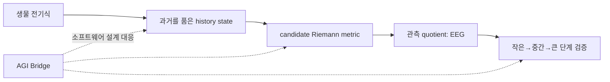

# CE-AGI Runtime: 뇌의 전기 동역학에서 현재 세계 모델까지

> 상태: **연구 중 — 실제 EEG의 첫 작은 기준선은 실패했으며, 의식·뇌 작동에 관한 결론은 보류한다.**

이 저장소는 뇌가 정보를 전기적으로 전달하고, 과거를 품은 연결망 상태가 어떻게 하나의 행동 가능한 세계 모델을 만들 수 있는지 연구하는 CE-AGI runtime이다. 목표는 “의식이 무엇이다”라고 선언하는 일이 아니라, 생물 전기식에서 출발해 관측 가능한 예측까지 가는 식을 만들고 작은 반증 실험부터 통과시키는 일이다. 이 README는 먼저 직관을 잡고, 다음으로 수학의 각 기호가 무엇을 뜻하는지 설명하며, 마지막으로 현재 데이터가 어디에서 멈췄는지를 밝힌다.

프로젝트의 순서는 엄격하다. 이미 알려진 생물학적 전기 기전을 출발점으로 두고, 그 위에 제안 가설을 분리해 적고, EEG 같은 측정값이 실제로 무엇을 잃는지 모델링한 뒤, 작은 검증부터 독립적으로 진행한다. 아래 그림은 증명 그림이 아니라 이 설계의 흐름도다. 화살표가 곧 뇌의 인과 법칙이나 의식의 증거를 뜻하지는 않는다.

## 초록

뇌를 단일 숫자 가중치의 그래프가 아니라, 전압·이온 상태·시냅스의 과거 반응이 함께 변하는 동적 네트워크로 본다. 이 관점에서는 각 연결이 과거 입력에 반응하는 함수이므로 자연스러운 상태공간이 매우 고차원이고, 연속 과거를 보존하면 무한차원 힐베르트 공간으로 표현할 수 있다. 이 저장소는 그 공간 위에 후보 리만 계량을 정의하고, 사용자가 제안한 “여러 가능한 세계 가운데 하나가 지금-여기 세계로 특권화된다”는 생각을 별도의 미완성 가설로 다룬다.

그러나 두 가지를 구별해야 한다. 케이블 방정식과 전도도 기반 전류 보존은 생물물리의 출발 모형이고, 현재-세계 다양체는 아직 검증되지 않은 물리 사상이다. 두 모델을 두피 EEG에 연결할 때도 EEG는 뉴런별 간선이나 실제 계량을 직접 읽지 못하며, 관측 kernel을 나눈 quotient만 제공한다. 가장 최근의 실제 EEG R0 검증은 장치·자료 접근에는 성공했지만, 사전 고정한 작은 2차원 선형 기준식이 persistence를 이기지 못했다. 이 결과는 전기식이나 의식 가설의 반증이 아니라, 그들을 너무 거칠게 줄인 기준식의 실패다.

## 질문과 출발점

한 해 전에 이 문제를 처음 배운 독자라면 먼저 이렇게 생각하면 된다. 뉴런은 전압차가 있으면 전류를 주고받고, 연결의 세기와 반응성은 과거 스파이크·전압·화학 상태에 따라 달라진다. 따라서 뇌 상태는 지금 켜진 뉴런 목록이 아니라, 지금의 전기 상태와 아직 사라지지 않은 과거의 흔적을 함께 가진 대상이다. 이 저장소의 첫 질문은 그 대상을 어떤 식으로 써야 하는가이다. 두 번째 질문은 그 식의 어떤 부분이 EEG로 시험 가능한가이다.

의식에 관한 질문은 이보다 한 단계 뒤에 둔다. 정상 각성에서 우리는 기억, 상상, 미래 계획을 동시에 접근할 수 있어도 그 전부를 현재라고 경험하지 않는다. 여기서는 이 비대칭을 가능한 세계 후보들 가운데 하나가 NOW/HERE 특권을 얻는 과정으로 표현해 본다. 이는 매력적인 설명 후보지만 현재 관측으로 확정한 뇌 기전이 아니다.

## 도시·지도·교통의 비유

뇌를 거대한 도시로 비유해 보자. 건물은 뉴런, 길은 시냅스와 축삭, 길 위의 차량 흐름은 전류와 스파이크에 대응한다. 이 비유에서 중요한 점은 길 하나가 단순한 숫자 $W_{ij}$가 아니라는 데 있다. 비가 왔는지, 조금 전 교통량이 컸는지, 신호가 어떻게 바뀌었는지에 따라 같은 길도 통과 속도와 용량이 달라진다. 그래서 도시의 현재 상태를 알려면 현재 차 위치만이 아니라, 아직 교통에 영향을 주는 최근 사건의 기록도 알아야 한다.

지도 비유는 계량을 설명한다. 지도 위의 두 장소가 종이에서는 가까워도, 공사·일방통행·혼잡 때문에 실제 이동에는 멀 수 있다. 리만 계량은 상태공간에서 이 기능적 거리를 정하는 규칙 후보다. 현재 감각, 신체 상태, 최근 기억, 즉시 가능한 행동이 서로 빠르게 영향을 주면 이들은 기능적으로 가까운 영역을 만들 수 있다. 반면 오래된 학교나 상상한 화성은 표현되어 있어도 현재 행동 제어와의 기능적 거리가 클 수 있다.

교통 비유는 여기서 멈춘다. 뉴런에는 지도 관리자나 고정된 도로망이 없고, 전기장·세포 종류·비선형 이온 통로·다중 시간척도가 있다. 또한 지도상의 거리와 주관적 경험의 거리는 같은 물리량이라고 알려져 있지 않다. 비유는 왜 history와 계량을 도입하는지 돕지만, 의식을 증명하지 않는다.

## 무엇이 확립되었고 무엇이 가설인가

이 프로젝트는 한 식에 모든 뜻을 섞지 않는다. 생물 전기 기전, CE의 추가 가설, 측정 모형, AGI 구현을 층으로 나누면 실패가 났을 때 어느 층을 고쳐야 할지 알 수 있다.

| 층 | 이 README에서의 역할 | 현재 지위 |
|---|---|---|
| 생물 전기식 | 전류 보존과 전압 변화의 출발점 | 확립된 기전의 출발 모형 |
| CE 가설 | history 상태, 후보 계량, 현재-세계 특권화 | 공리: 물리 사상, 미완성 |
| 측정 모형 | 숨은 뇌 상태에서 EEG로 가는 관측 연산 | 식별 한계를 가진 필요 단계 |
| AGI Bridge | 같은 계산 구조를 가진 소프트웨어 설계 | 뇌 동일성 주장이 아닌 공학적 대응 |

이 층분리는 말의 강도를 제한한다. 실제 데이터에서 어떤 예측이 맞더라도 바로 뇌가 이 방식으로 작동한다고 말할 수는 없다. 개입 자료까지 포함한 높은 증거 단계 L4 전에는 그런 문장을 금지한다. 합성 시뮬레이터에서의 AGI 성과는 L0, 즉 구현이 그 계산을 수행했다는 수준이다.

## 전기적 출발 모형

뉴런 $i$의 막전압을 $V_i(t)$, 막 정전용량을 $C_i$, 연결 $j\to i$의 유효 전도도를 $g_{ij}[h_t]$라고 쓰자. $w_i$는 이온 통로의 gate 상태, $I_{\mathrm{ext},i}$는 외부 입력이고, $h_t$는 $t$ 이전의 관련 기록이다. 가장 간결한 전류 보존 출발식은 다음과 같다.

$$
C_i\frac{dV_i}{dt}
= \sum_j g_{ij}[h_t](V_j-V_i)
- I_{\mathrm{ion},i}(V_i,w_i)
+ I_{\mathrm{ext},i}(t).
$$

왼쪽은 전압을 바꾸는 데 필요한 전류다. $C_i$의 단위는 패럿(F), $dV_i/dt$의 단위는 V/s이므로 곱은 암페어(A)가 된다. 오른쪽의 각 항도 전류(A)여야 한다. 전도도 $g_{ij}$는 지멘스(S), 전압차는 V이므로 $g_{ij}(V_j-V_i)$ 역시 A다. 이 단위 점검은 멋있어 보이는 항을 아무 단위로나 더하는 실수를 막는다.

긴 가지돌기를 공간적으로 풀려면 케이블 방정식의 꼴도 쓸 수 있다.

$$
c_m\frac{\partial V}{\partial t}
= \frac{1}{r_a}\frac{\partial^2 V}{\partial x^2}
- i_{\mathrm{ion}}(V,w)
+ i_{\mathrm{syn}}(x,t)+i_{\mathrm{ext}}(x,t).
$$

여기서 $x$는 한 가지돌기를 따른 위치이고, $c_m$은 길이당 막 정전용량, $r_a$는 축방향 저항, $i$들은 길이당 전류다. 이 PDE는 전압이 직선으로 번진다는 식이 아니라, 확산·누설·이온 비선형성·시냅스 입력이 함께 전파를 정한다는 최소 표현이다. 그래도 이것은 뇌 전체를 완결하는 식이 아니다. 세포 종류, 삼차원 형태, glia, 혈류, 관측 장치까지 모두 이 한 줄에 담기는 것은 아니다.

## 과거를 품은 상태공간

시냅스가 과거에 반응한다면 $g_{ij}$는 단일 상수가 아니라 history $h_t$의 함수가 된다. 예를 들어 지수적으로 오래된 과거를 약하게 만드는 가중치 $\rho$ 아래, 다음 상태공간을 후보로 둘 수 있다.

$$
\mathcal H
= \mathbb R^{N_V+N_w}
\times \bigoplus_{e} L^2_\rho(( -\infty,0]).
$$

앞 항은 현재의 전압과 이온 gate를, 각 $L^2_\rho$ 항은 간선 $e$에 붙은 과거 함수의 제곱적분 가능한 기록을 뜻한다. 이 공간이 무한차원인 이유는 과거를 유한 개 숫자로 잘라 저장하지 않고 연속 함수 전체로 보존하기 때문이다. 무한차원은 무한히 많은 뉴런이 있다는 뜻이 아니라, 함수 하나를 지정하려면 원칙상 무한히 많은 자유도가 필요하다는 뜻이다.

다만 fading memory, 즉 아주 오래된 기록의 영향이 줄어든다는 가정과 이 공간에 매끄러운 구조가 있다는 가정은 추가 선택이다. 데이터가 history의 어느 부분을 보존하는지, 어떤 $\rho$가 맞는지는 아직 결정되지 않았다. 무한차원 표기는 설명의 출발점이지 식별된 뇌 좌표계가 아니다.

## 후보 리만 계량과 방향성

상태 $x\in\mathcal H$에서 작은 변화 $u,v$의 기능적 길이와 각도를 정하려면 다음 꼴의 연산자 계량을 후보로 둘 수 있다.

$$
A_x=A_{0,x}+\sum_e D_e^*K_eD_e,
\qquad
g_x(u,v)=\langle u,A_xv\rangle.
$$

여기서 $D_e$는 간선 $e$의 변화·지연·필터 같은 국소 차이를 뽑는 연산자이고, $K_e$는 그 차이에 부여하는 가중 연산자다. $A_x$가 매끄럽고, self-adjoint이며, coercive하고 bounded라는 조건 아래 $g_x$는 길이를 음수가 되지 않게 측정하는 후보가 된다. 다시 말해 완전히 다른 상태는 멀고, 현재 기능에 민감하게 연결된 변화는 가까울 수 있도록 정한다.

리만 계량은 대칭이다. 따라서 $u$에서 $v$로의 길이는 $v$에서 $u$로의 길이와 같게 취급한다. 실제 신경 연결은 방향성을 가지므로 그 비대칭은 계량에 억지로 넣지 않고, 전류식의 흐름이나 생성자 $F(x,h_t)$에 둔다. 계량은 무엇이 가까운가를, 흐름은 어디로 시간이 진행하는가를 맡는다. 이 분리는 수학적 편의이면서 생물적 비대칭을 감추지 않기 위한 선택이다.

## 현재 세계의 특권화 가설

사용자가 제안한 중심 생각은 다음과 같이 읽을 수 있다. 뇌의 숨은 상태는 고차원일 수 있지만, 경험되는 세계는 매 순간 하나의 일관된 시공간적 조직을 우세하게 유지한다. 여기서 3+1은 신경 상태 다양체의 차원을 고정하는 말이 아니다. 선택된 세계모델이 표현하는 공간·시간 구조의 후보다. 신경 상태 자체의 차원은 훨씬 크거나 history 때문에 무한차원일 수 있다.

**[공리: 물리 사상] [미완성]** 시간 $t$에 가능한 세계 후보를 $M_k(t)$로 두고, 감각·신체·시간·상충 비용을 모두 무차원화한 뒤 다음 에너지를 정의해 보자.

$$
E_k
=\lambda_sD_{\mathrm{sens},k}
+\lambda_bD_{\mathrm{body},k}
+\lambda_\tau D_{\mathrm{time},k}
+\lambda_cD_{\mathrm{conflict},k}.
$$

여기서 $D_{\mathrm{sens}}$는 감각 입력과의 어긋남, $D_{\mathrm{body}}$는 신체 위치·행동 가능성과의 어긋남, $D_{\mathrm{time}}$은 직전 시간과의 연속성 위반, $D_{\mathrm{conflict}}$는 후보들 사이의 양립 불가를 나타내는 비용 후보다. $\lambda$와 온도 $T$가 모두 무차원이라는 정규화가 선행되어야 지수 함수의 인자가 의미를 갖는다.

$$
\pi_k(t)=\frac{\exp(-E_k/T)}{\sum_\ell\exp(-E_\ell/T)},
\qquad
k^*(t)=\operatorname*{argmax}_k\pi_k(t),
\qquad
M_{\mathrm{present}}(t)=M_{k^*}(t).
$$

가장 우세한 후보와 두 번째 후보의 차이는 현재성의 단순 지표 후보로 쓸 수 있다.

$$
\Gamma(t)=\log\frac{\pi_{(1)}(t)+\varepsilon}
{\pi_{(2)}(t)+\varepsilon}.
$$

$\Gamma$가 크면 이 정의 아래 한 후보가 다른 후보보다 강하게 특권화되었다는 뜻일 뿐, 주관적 의식의 크기를 측정했다는 뜻은 아니다. 기억은 과거 태그가 강한 후보, 상상은 감각 anchor가 약한 반사실 후보, 꿈은 외부 감각 anchor가 약한 내부 생성 후보로 비유할 수 있다. 이 비유도 기억·상상·꿈의 신경 기전을 설명한 결과는 아니다.

국소적으로 현재 세계 쪽 변화와 그 밖의 변화를 다르게 재는 단순 계량은 다음처럼 쓸 수 있다.

$$
g_x(u,u)=a\lVert P_*u\rVert^2
+b\lVert(I-P_*)u\rVert^2,
\qquad 0<a<b.
$$

$P_*$는 선택 후보의 접공간 쪽 성분을 뽑는 사영 후보다. $a<b$이면 같은 크기의 변화라도 현재-세계 방향은 더 짧게, 밖의 변화는 더 길게 측정한다. 이것은 metric concentration을 설명하는 local model이지, 실제 뇌에서 계수나 사영을 측정한 식이 아니다.

다양체의 수학적 차원은 정수다. 반면 관측 스펙트럼의 유효차원은 연속값일 수 있다. 예컨대 고유값 비율에서 얻은 확률 $p_r$로

$$
d_{\mathrm{eff}}=\exp\left(-\sum_r p_r\log p_r\right)
$$

를 정의하면 $d_{\mathrm{eff}}$는 정수가 아닐 수 있다. 이것을 의식이 4가 아닌 연속 차원이라고 부르면 서로 다른 개념을 섞게 된다.

## 해마를 해시로 보는 비유

해마가 빠른 주소 지정에 관여한다는 생각은, literal cryptographic hash가 아니라 희소한 주소 후보로 표현할 수 있다.

$$
h=\operatorname{Sparse}_s(B_zz+B_cc+B_\tau\tau-\vartheta).
$$

$z$는 현재 표현, $c$는 문맥, $\tau$는 시간 단서, $\vartheta$는 활성화 문턱이다. 이 식은 적은 수의 주소 성분이 활성화되어 기억 후보를 빨리 찾는다는 공학적 비유를 만든다. 해마가 정보를 새로 만들거나, 고차원 상태를 4차원 bottleneck으로 정확히 복원한다는 뜻은 아니다. 실제 해마의 표상과 이 식의 대응은 별도의 실험 문제다.

## EEG는 무엇을 보고 무엇을 잃는가

실제 기록은 숨은 상태 $q_t$를 직접 주지 않는다. 관측 $y_k$는 대략 다음처럼 쓴다.

$$
y_k=\mathcal H(q_{t_k})+\epsilon_k.
$$

$\mathcal H$에는 두피까지의 전도, 센서 배치, 기준전극, 필터와 전처리가 들어가고, $\epsilon_k$에는 잡음과 모델에 적지 않은 오차가 들어간다. 따라서 두피 EEG는 수많은 숨은 상태 중 같은 기록을 만드는 상태를 구별할 수 없다. 관측 kernel을 나눈 quotient만 볼 뿐이며, 뉴런 간선 하나의 전도도, 실제 리만 계량, 혹은 현재 세계 후보를 식별하지 못한다.

이 한계는 path와 self에도 적용된다. 유한한 history feature는 상태를 확장하면 순간 상태의 일부로 다시 표현할 수 있다. 그러므로 path 항이 기준선보다 예측을 개선하더라도 자아는 존재론적으로 path라는 결론은 나오지 않는다. 개선은 모델 비교의 결과일 뿐 존재론의 증명은 아니다.
