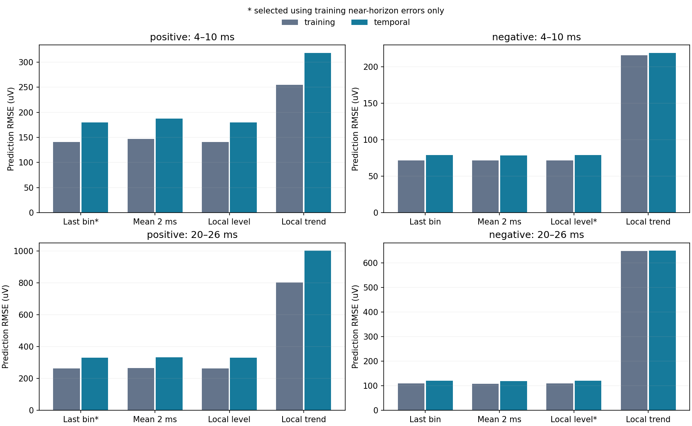
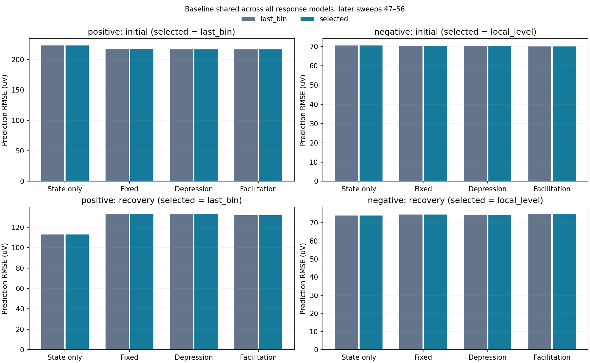

# Allen: 무명령 전압 상태와 조건부 회복 예측

2026-09-19. 질문은 **앞선 전압 상태를 이용해 예측한 뒤에도 발화 이력에 따른 효능
변화가 미래 반응을 더 잘 설명하는가**다. [이전 파형 분석](allen_recovery_waveform_findings.md)의
개선이 전압 오프셋 가정에 민감했으므로, 무명령 구간에서 기준선 예측을 먼저 선택했다.
기존 결과·소스·검사를 덮어쓰지 않은 후속 분석이며, 이미 본 자료의 회고적 개발이다.

양성 표적에서는 직전 전압 유지가 선택됐다. 뒤 10시행의 회복 반응에서는 이 상태만의
예측 RMSE가 112.939µV였고, 고정 효능 133.166µV, 약화 132.993µV, 촉진 131.932µV였다.
**이번 조건에서 이력 효능을 추가해 회복 예측을 개선한다는 주장은 지지되지 않았다.**
이는 가소성이 없다는 판정도, RC 막 시정수를 식별했다는 판정도 아니다.

## 1. 자료·계보·관측 예산

실험 `1574292898.139`의 같은 source 18952/ext6/AD9와 positive 18951/ext5/AD8,
negative 18950/ext3/AD2를 재사용했다. positive에는 흥분성 연결 라벨이 있으며,
negative에는 보고된 시냅스가 없다. negative를 억제성으로 해석하지 않는다.
생산자 추정 시냅스 진폭·잠복기는 적합에 사용하지 않았다.

- 무명령 창: sweeps 37–56의 0.08–0.53s, 100kHz 표본 45,000개씩.
  50표본 평균으로 0.5ms 전압 900개를 만든다. 앞 10시행만 교정·선택에 사용한다.
- source와 두 target의 저장 DA 기준 구간 60개는 모두 0A다. source의 quiet
  구간에는 기존 검출 규칙의 AP가 없다. 미관측 뉴런의 입력이 없다는 뜻은 아니다.
- 파형 부모의 source NPZ 20개·target NPZ 40개, 명령 archive 및 부모 출력의
  해시를 확인했다. 다운로드·기존 NWB 캐시 수정은 없다.
- 반응 예측은 부모의 43/50 표적-시행을 그대로 쓴다. 37–56의 두 target 40개와
  입력을 확인한 32–34 positive 3개다. 결손과 target 자체 입력에 따른 7개 제외
  행은 결과 JSON에 보존했다. 빠진 source 활동을 0으로 만들지 않았다.
- **관측 예산 변경:** 각 반응 이전의 target 전압 중 명령·발화 인접 구간과 모든
  점수화 반응창을 제외한 부분을 사용할 수 있다. 이전 전체 파형 분석은 시작 기준선
  이후 target 전압 없이 예측했다. 이번 짧은 조건부 반응 RMSE와 그 값을 직접
  비교해 성능 개선으로 읽지 않는다.

## 2. 무명령 상태 후보와 선택

후보는 직전 0.5ms 평균, 직전 2ms 평균, local level, local linear trend 네 가지다.
마지막 두 후보는 다음 통계적 상태공간식의 인과적 Kalman 예측·갱신으로 계산한다.
이 방법은 상태와 관측을 나눠 과거 관측으로 다음 값을 추정하는 절차이며,
[Kalman의 원 논문](https://people.duke.edu/~hpgavin/SystemID/References/Kalman-JBE-1960.pdf)을
방법론 근거로 쓴다. 아래 상태식이 실제 막의 생리식이라는 주장은 하지 않는다.

\[
 x_{k+1}=F x_k+\xi_k,\qquad y_k=H x_k+\epsilon_k,
 \qquad \operatorname{Cov}(\xi)=rQ_0,\quad \operatorname{Var}(\epsilon)=r.
\]

local level은 $F=H=1$, $Q_0=q$다. local trend는

\[
 F=\begin{pmatrix}1&1\\0&1\end{pmatrix},\quad H=(1,0),\quad
 Q_0=q\begin{pmatrix}1/3&1/2\\1/2&1\end{pmatrix}.
\]

한 시간 단위는 0.5ms이고 둘째 좌표는 µV/bin이다. 앞 10 quiet 시행에서 초기 100ms를
제외한 Gaussian innovation likelihood로 $q\in[10^{-6},10^4]$의 41격자와 분산 척도
$r$를 선택한다. 각 후보의 4–10ms 평균 예측 학습 MSE로 family를 고른다. 교정 이후
뒤 10시행을 보고 파라미터를 바꾸지 않는다. 100ms 이후 10ms마다 32개 원점에서
4–10ms·20–26ms 평균을 예측한다. 겹치는 창은 독립 표본이 아니다.

| 표적·선택 | 앞 10 near | 뒤 10 near | 앞 10 far | 뒤 10 far |
|---|---:|---:|---:|---:|
| positive, 직전 값 | 140.600 | 179.728 | 263.926 | 330.622 |
| negative, local level | 71.459 | 78.741 | 108.799 | 120.587 |

단위는 모두 µV RMSE다. negative의 선택 $q=10^4$는 격자 상단이고 관측분산 척도는
0.053472µV²다. 이 경우 갱신이 관측값에 거의 전부 의존해 직전 값과 사실상 같다.
학습 near 오차 차이는 약 0.000192µV에 불과하다. positive local level도 $q=10^4$,
분산 0.065796µV²에서 직전 값과 거의 같지만 선택되지 않았다. 이 경계 선택을
측정기 잡음의 정확한 분산이나 막의 생리 파라미터로 채택하지 않는다.

추세 후보의 뒤 시행 near/far RMSE는 positive 318.420/1002.511µV,
negative 218.660/648.686µV로 선택 기준선보다 컸다. negative의 뒤 시행에서는 2ms
평균이 선택 후보보다 조금 나았지만, 뒤 시행 성적을 보고 family를 다시 고르지 않았다.

positive의 **선택되지 않은** local level 후보를 진단하면 1.96 표준편차 범위의 뒤
시행 포함률이 near 85.0%, far 77.2%이고, 1-step 표준화 innovation의 lag-1 상관도
0.287이다. 이를 교정된 Gaussian 잔차 법칙으로 보기 어렵다. negative 선택 후보의
뒤 시행 포함률은 96.9%·98.4%, lag-1 상관은 0.094다. 포함률만으로 독립성·정규성·
정상성이 확립되지 않으며, 이를 실제 Fisher 계량의 측정 likelihood로 사용하지 않는다.

## 3. 동일한 기준선 위의 반응 예측

각 source AP 뒤 [2,8]ms에 완전히 들어가는 0.5ms 표본 평균을 점수화한다.
$M$은 그 평균 연산자다. $B$는 그보다 앞선 사용 가능한 전압으로 해당 창을 예측하는
인과적 연산자다. 부모의 command−0.5ms부터 AP+2ms까지 artifact 마스크와 모든
AP+[2,8]ms 점수창은 상태 갱신에서 제외한다. 직전 값 대조에도 같은 마스크를 쓴다.
각 $B$행은 자기 점수창 이후의 계수가 0이며 합이 1인지 확인한다.

후속 시각 대조에서 확인한 구현 예외: 이 버전의 `(left<0)|valid`는 첫 명령 직전
[−0.5,0]ms bin도 복원한다. 따라서 첫 command의 pre guard 한 bin은 위 기술과
다르게 허용됐다. 미래 반응을 사용한 것은 아니다. 기존 소스·결과는 보존했고,
[후속 파형 분석](allen_source_timing_findings.md)은 첫 guard를 정확히 적용해
[−1.0,−0.5]ms를 마지막 pre bin으로 쓴다.

커널과 이력식이 만드는 단위 진폭 파형을 $x_\theta$, 진폭을 $A\ge0$라 두면

\[
 \widehat y=B y+A(M-B)x_\theta
 =B(y-Ax_\theta)+A Mx_\theta.
\]

즉 후보가 예측한 이전 파형의 꼬리는 기준선 상태를 계산할 때 함께 빼 준다.
기준선만의 모형은 $A=0$이다. 고정 효능·약화·촉진은 모두 같은 $B$와 140개 커널,
46개 효능 후보를 사용한다. 처음 10시행의 초기 8반응만으로 맞추고, 공통 자유
오프셋이나 시행별 반응 사후 기준선은 적합하지 않는다. 뒤 10시행·회복 4반응·
다른 회복 간격은 이 적합에 포함되지 않는다.

| 뒤 10시행, quiet 선택 기준선 | 상태만 | 고정 효능 | 약화 | 촉진 |
|---|---:|---:|---:|---:|
| positive 초기 8반응 | 223.315 | 217.232 | 216.751 | 217.131 |
| positive 회복 4반응 | **112.939** | 133.166 | 132.993 | 131.932 |
| negative 초기 8반응 | 70.500 | 70.197 | 70.223 | 70.087 |
| negative 회복 4반응 | **73.960** | 74.461 | 74.295 | 74.929 |

단위는 µV RMSE이며 시행별 MSE에 같은 가중치를 준다. positive 약화의 초기 오차는
고정 효능보다 7/10시행에서 작았지만 그 차이는 작다. 회복도 고정 효능보다 7/10에서
작았으나, 더 단순한 상태만의 기준을 이긴 시행은 3/10이며 전체 RMSE는 더 크다.
작은 후보 간 차이와 좋은 기준선 대비 개선을 구별해야 한다.

positive의 quiet 선택과 직전 값 민감도는 **동일한 모형**이다. 독립 확인 두 개로
세지 않는다. negative 직전 값 대조도 초기·회복 RMSE가 선택값과 약 0.001µV 이내다.
추가 상태 추세가 필수라는 근거는 이번 선택에서 얻지 못했다.

positive의 다른 회복 간격 3시행에서는 상태만 120.094, 고정 108.493, 약화 107.080,
촉진 110.112µV였다. 약화는 고정보다 3/3, 상태만보다 2/3에서 작았다. 간격마다 한
시행이고 이미 본 데이터이며, 뒤 10시행 회복 실패를 상쇄하는 독립 검증이 아니다.
약화의 회복시정수·커널 지연 등 여러 최적값이 탐색 경계에 놓였으므로 고유 생리값으로
읽지 않는다. 정확한 선택값과 모든 시행 결과는 JSON·notebook에 보존했다.

## 4. 위상·기억·계량에 대한 판정과 다음 조건

sin·cos 분해에서 순수 지연은 $e^{-i\omega\Delta}$, 고정 RC 막의 필터링은
$R/(1+i\omega RC)$로 표현된다. 전자는 일정 시간 이동이고 후자는 주파수에 따라
진폭과 위상을 바꾼다. 두 표현은 [수동 막의 시간·주파수 설명](https://neuronaldynamics.epfl.ch/online/Ch1.S3.html)과
연결되지만, 현재 분석은 source 주입 전류가 target 시냅스 전류와 같다고 놓지 않았다.
실제 지연·RC·시냅스 효능의 동시 식별은 아직 **미확립**이다.

이번에 **완료**한 것은 quiet-only 교정 후보와 미래 관측 누출을 차단한 공통 기준선
비교다. **지지되지 않은 것**은 이 기준선 위에서 약화·촉진 후보가 뒤 시행의 회복
예측을 개선한다는 명제다. 전압 상태가 과거를 요약한다는 수학적 사실, 실제 단기
가소성의 존재, 이 연결의 가소성식 식별은 각각 다른 주장이다. 기준선 추정이 실제
느린 반응 일부도 흡수할 수 있고, quiet와 자극 중 상태 통계가 같다는 보장도 없다.

다음에는 같은 격자를 확대하기보다 **자극 시각을 옮긴 대조와 파형 정보를 더 보존한
반응창에서, source 시각에 특이적인 예측 이득이 있는지**를 구별해야 한다. 현 상태
관측만으로 얻는 이득과 source 사건에 시간 고정된 효과를 먼저 나누고, 적합에 쓰지
않은 주파수·간격에서 재현되어야 한다. 이미 본 기록의 반복 분석은 탐색으로 남긴다.
그 뒤에야 장기 효능 변화·비용 계량·해마 검색·현재 세계 선택에 필요한 별도 측정을
연결한다. Gaussian 모형의 공분산을 리만 가정의 실측 검증으로 대체하지 않는다.

## 5. 검증·산출물·재현

- 관련 검사 9개 통과. 미래·누락 표본 불변성, 점수창 차단, 상수 제거, 직접 상태
  예측과 연산자 일치, 평균 예측 공분산과 공동 공분산 일치, 적합에서 회복·뒤 시행
  차단을 검사했다. 전체 테스트·벤치마크는 실행하지 않았다.
- [분석 소스](../verify/Q-NPF-04/allen_synphys/recovery_causal_baseline.py),
  [검사](../tests/test_recovery_causal_baseline.py),
  [결과 JSON](../verify/Q-NPF-04/allen_synphys/recovery_causal_baseline_result.json),
  [배열 NPZ](../data/local/allen-synphys-analysis/recovery-causal-baseline-v1/causal_baseline_arrays.npz).
- 결과 SHA-256: `7576569de951b24c15a6c1abb7c7017c769c781380c244015177cf5621065a3f`.
  배열 SHA-256: `ae3be224a99d1623ca8e39a0a3117d730a42ce2908f5941e0060e305076707c6`.
- [notebook](../verify/Q-NPF-04/allen_synphys/recovery_causal_baseline.ipynb)과
  [생성기](../verify/Q-NPF-04/allen_synphys/build_causal_baseline_notebook.py)를 함께 보존한다.
- notebook 코드 셀 4개 순서 실행, 오류 0. 저장 배열에서 quiet RMSE, 688개 시행별
  MSE·bias와 80개 그룹 RMSE를 재계산했다. 그림 2개를 시각 검수했고 외부 PNG와
  notebook 내장 이미지의 바이트가 일치한다.

분석 실행은 `C:/dev/ce/ce-agi-runtime-repro-fffd356/.codex/hooks/python.cmd`로
`pytest tests/test_recovery_causal_baseline.py`,
`python verify/Q-NPF-04/allen_synphys/recovery_causal_baseline.py`를 각각 한 번 실행했다.
Python3.11.9·NumPy2.4.6을 썼다. notebook은 이전에 사용한 Python3.11.15와 기존
외부 임시 의존성 경로를 재사용한다. 생성기는 기존 출력을 거부한다.

저장소는 `C:/dev/ce/ce-agi-runtime`, main, upstream origin/main이다. HEAD와 로컬
원격 추적 ref는 `fffd356ee4f1f7bf5079f3379cd06e4dc56a444c`이며 새 fetch·커밋·push는
하지 않았다. 라이브러리 분리·이전 연구의 다른 변경은 보존했다.

후속 [발화 시각과 파형의 분리](allen_source_timing_findings.md)에서 source만 이동한
대조와 짧은·긴 창의 전체 파형 적합을 완료했다. 평균으로 버린 모양을 보존해도
양성의 짧은 회복 우위는 생기지 않았다. 이전 반응을 관측에 포함하는지에 따라
최적 이력 시정수가 크게 달라져 관측 상태와 효능 변화의 구별을 계속 유지한다.
