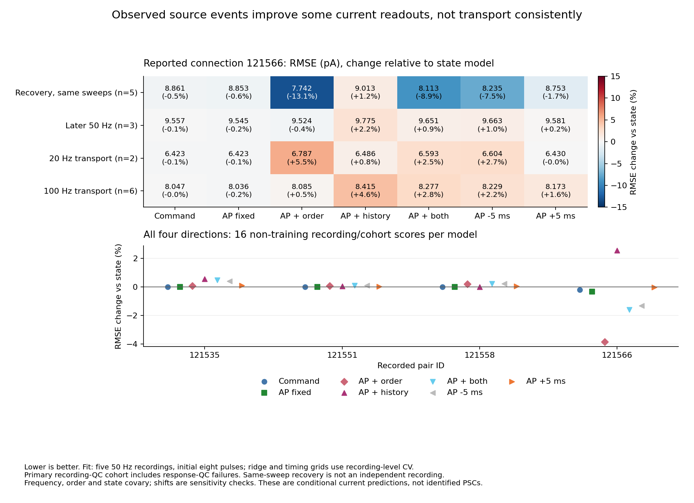

# Allen: 실제 source 전압 사건으로 target 전류를 예측했다

2026-09-20. [원파형과 측정 상태](allen_mixed_clamp_waveform_findings.md)를 재사용해
관측된 source 발화 시각에 조건부인 전류 예측을 처음 비교했다. 보고된 연결121566에서
반복 순서를 넣은 모형은 같은 시행의 회복을 개선했으나20·100Hz 전이에서는 우위가
유지되지 않았다. 지수 발화 이력 항도 일관된 개선을 보이지 않았다. 이 후보를 학습·
가소성·전도도·리만 계량의 실측식으로 채택하지 않는다.

## 동일한 관측과 평가 조건

양쪽 recording QC와 source 원전압의 단일0mV 상향 통과·창 시작 below-zero 조건을
사용했다. 이 문턱은 명령에 따른 전압 사건의 운영적 정의이며 정확한 AP 수의 보증은
아니다. Target response에서 산출된 `response_ex_qc`는 primary 선택에 쓰지 않았다.
기존 QC 통과758개는 같은 fit의 별도 점수로 보존했다. 누락 stored spike time도 원전압
사건이 있으면 유지했다. 반응이 좋은 사건만 골라 적합하는 것을 피한 변경이다.

| 구간 | 시행 번호 | Primary 사건 | response QC subset |
|---|---|---:|---:|
| 학습: 초기8 pulse | 69–73 | 160 | 159 |
| 같은 시행의 회복4 pulse | 69–73 | 80 | 79 |
| 뒤50Hz 시행 전체 | 74–76 | 144 | 143 |
| 20Hz 시행 전체 | 77–78 | 96 | 96 |
| 100Hz 시행 전체 | 82–87 | 287 | 281 |

네 pair의 학습 사건은 각각40개다. Primary 합767개 중 학습160·평가607이며 나머지
385개 pulse의 제외 이유는 결과에 남겼다. 모든 accepted 사건의 raw 관측지원과 다음
source 명령·target 자기 명령 비중첩을 확인했다. 파형진단에서 관측된 AP–command
간격은 약0.710–1.830ms다. 초기·회복 위치와 조건명은 실제 시행 구성을 보존하며
주파수를 시행 순서·세포 상태로부터 분리한 개입으로 해석하지 않는다.

Target은 원전압 최대 상승률 시각 뒤[1,7)ms의30개0.2ms bin 평균이다. 가장 가까운
raw 표본에서 시작하고 보간하지 않는다. 모든 모형의 기준선은 command 직전
[−2,−0.2)ms 평균이다. 동일한 raw 전류 표본을 유지한 채 kernel의 기준 시각만
command/AP로 바꾼다. 이 예측은 관측된 source 전압 사건에 조건부이며 자극 전
미래 발화를 예측하는 모형이나 인과 전달의 증거가 아니다.

## 상태·시각·순서·이력의 비교식

기준선만 유지하는 모형과 다음 공통식을 비교했다.

$$
\widehat I_e(u)=b_e+s(q_e,u)
 +k(u-\delta)\left[a_0+a_n n_e+a_t\log(1+\Delta t_e/0.02)
 +a_h h_e(\tau)\right],\qquad
h_e(\tau)=\sum_{t_j<t_e}\exp[-(t_e-t_j)/\tau].
$$

상태항 `s`는 직전 target 전류 평균·앞뒤 절반의 전류 차이·source 직전 전압·target
access resistance·직전 target 명령 종료 후 간격의 log1p와 완만한 선형 시간 기저다.
각 모형에서 같은 상태 정보를 사용했다. Kernel은0.5ms rise를 고정한 두 지수의
차이이며 peak1로 정규화한다. 상태 전용, command 고정 kernel, AP 고정 kernel,
AP+순서, AP+이력, AP+순서+이력, 마지막 모형의 AP시각±5ms 대조를 적합했다.
순서 모형에는 pulse 번호와 첫 command 이후 경과시간을 함께 넣었다.

이력은 같은 시행에서 현재보다 앞선 모든 관측된 명령 유발 전압 사건으로 만든다.
Target response QC에 따라 과거 사건을 삭제하지 않는다. 첫 사건 이전·시행 이전의
숨은 활동이나 자발 발화를 없었다고 가정하지 않으며, 해당 성분은 이 관측 이력에
들어 있지 않다. 지수항은 생물학적 단기 가소성 모델을 동기로 삼은 예측 후보다.
[Tsodyks–Markram 원연구](https://doi.org/10.1073/pnas.94.2.719)의 방출 자원 동역학이나
생리 파라미터를 이 선형 이력 회귀로 추정했다고 보지 않는다.

Delay·decay·τ·ridge penalty는 학습5개 recording을 하나씩 남기는 교차검증으로만
고른다. 표준화 평균·scale·설계열 RMS도 해당 fold의 학습자료만 사용했다. τ 후보는
20/50/150/500/1500ms, AP delay는0.5/1/2ms, command delay는1/2/3/4ms,
decay는2/5/10ms다. Penalty는0.001/0.01/0.1/1/10이며 고정 순서로 동점을 처리한다.
회복·뒤 시행·다른 주파수의 target 값은 선택에 쓰지 않는다.

이미 원파형 예시와 전체 입력 진단을 본 후의 후향적 보류 비교다. 독립 상태 단위는
많은 표본점이나40개 pulse가 아니라5개 training recording이며, ridge가 계수를
계산해도 각각을 생리적 상태 효과로 식별할 수 없다. 이전 반응은 뒤 사건의 관측된
baseline에 영향을 줄 수 있다. 모든 모형에 이 같은 관측 예산을 허용했다.

## 보고된 연결에서의 결과

다음은 primary 집합의 시행별 MSE를 동일 가중하고 제곱근을 취한 RMSE(pA)다.
표의 같은 시행 회복은 새로운 recording 검증과 구별한다.

| 모형 | 같은 시행 회복 | 뒤50Hz | 20Hz | 100Hz |
|---|---:|---:|---:|---:|
| 직전 기준선 유지 | 9.237 | 9.001 | 6.895 | 7.996 |
| 상태 | 8.908 | 9.566 | 6.432 | 8.048 |
| Command 고정 | 8.861 | 9.557 | 6.423 | 8.047 |
| AP 고정 | 8.853 | 9.545 | 6.423 | 8.036 |
| AP+순서 | **7.742** | 9.524 | 6.787 | 8.085 |
| AP+이력 | 9.013 | 9.775 | 6.486 | 8.415 |
| AP+순서+이력 | 8.113 | 9.651 | 6.593 | 8.277 |

16개 비학습 recording/cohort 점수를 합친 RMSE는 상태8.4508, command8.4321,
AP8.4228, AP+순서8.1246, AP+이력8.6670, AP+순서+이력8.3161pA다. 회복의 개선을
전이 전반의 성공으로 읽지 않는다. AP+이력과 결합 모형은 모두 τ20ms 하한과 decay10ms
상한을 골랐으며 이를 생리 시정수로 채택하지 않는다. ±5ms 이동은 정렬 감도검사이며
독립 인과 null 대조가 아니다.

다른 세 pair에서는 기준선 유지가 상태 모형보다도 낮은 비학습 RMSE였다. AP 고정이
command보다 나은 것은2/4방향, AP+순서가 AP 고정보다 나은 것은121566 한 방향뿐이다.
네 방향 전체에서 발화 이력의 보류 예측 우위는 일관되지 않았다. 보고된 연결이 없는
세 pair를 실제 연결 부재가 증명된 음성군으로 바꾸지 않는다. 이 결과는 생물학적
기억 자체의 부재가 아니라 **현재 관측·조건·후보식에서의 전이 미지지**다.

## 재현과 다음 질문

[소스](../verify/Q-NPF-04/allen_synphys/mixed_clamp_ap_prediction.py),
[검사](../tests/test_mixed_clamp_ap_prediction.py),
[결과](../verify/Q-NPF-04/allen_synphys/mixed_clamp_ap_prediction_result.json)를 보존했다.
관련8개 검사는 과거 이력, causal kernel, 분할, 학습 전용 표준화, 평가 target 변경에
대한 fit 불변성, 학습 시행 결손, 동일 관측 대조와 관측지원 거부를 확인했다.
독립 검토에서도 fold 누출이나 치명적 구현 오류를 찾지 못했다. 새 다운로드는0바이트다.

결과 SHA는 `f49e06773fcc01701da16133746c68a7d678155b172786b6de71953753c5a84c`다.
예측 NPZ는 `data/local/allen-synphys-analysis/mixed-clamp-ap-prediction-v1/predictions.npz`,
SHA `e9bfdd6d72273a7ae4c174bbfb03e14320befb1f4fa64d0df33ee74570548145`이며52배열 모두
유한하다. 실행기는 `C:/dev/ce/ce-agi-runtime-repro-fffd356/.codex/hooks/python.cmd`다.
`pytest tests/test_mixed_clamp_ap_prediction.py` 후
`python verify/Q-NPF-04/allen_synphys/mixed_clamp_ap_prediction.py`를 offline 한 번 실행했다.
소스·검사·입력·NPZ 해시를 결과와 [데이터 원장](data_registry.md)에 남긴다.

이제 확인할 질문은 보고된 연결의 작은 AP-locked 성분이 측정 회로·source/target
상태를 넘어 안정적으로 분리되는지다. 같은 예측 결과의 격자를 넓혀 학습 성공을
선언하지 않는다. 조건별 raw waveform·측정잡음과 자극 이력의 식별 조건을 먼저
검토하고, 관측되지 않은 실제 target Vm이나 반복 간 숨은 상태를 계수로 대체하지
않는다. 해마의 사건 검색과 생물학적 계량으로 이어지는 공통 기전은 여전히 미확립이다.
