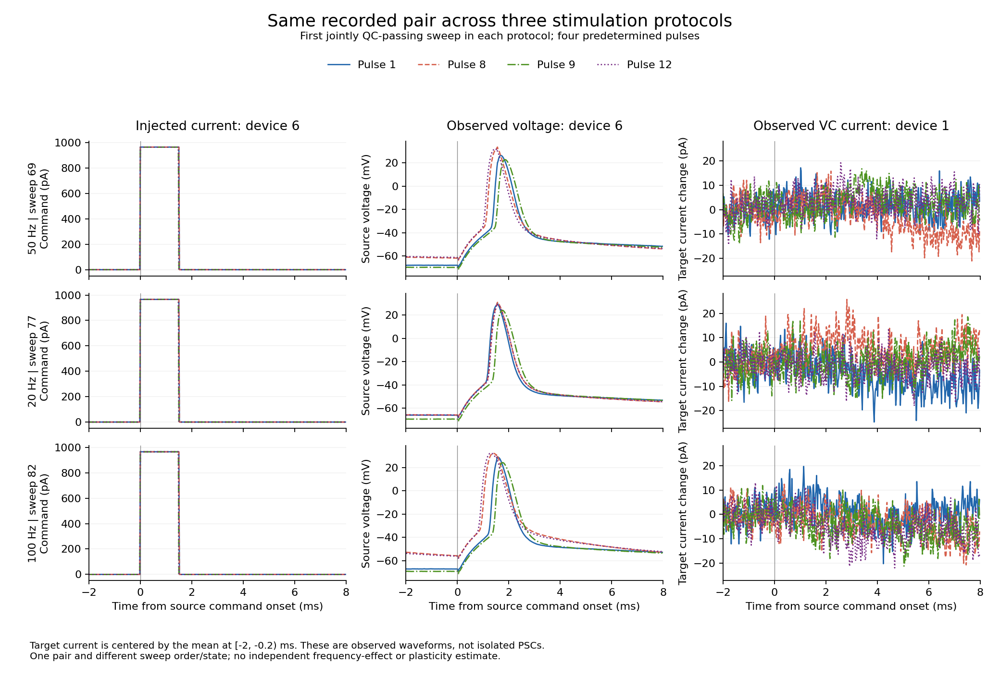

# Allen 혼합 기록: 실제 전압·전류와 측정 상태

2026-09-20. [앞선 입력 조사](allen_mixed_clamp_findings.md)의 다음 조건이었던 source
전압·target 전류·명령·공통 시각·측정 상태를 결합했다. 여기서 확인한 것은 실제 관측과
저장 검출 시각의 대응이다. 시냅스 전류의 분리, 이력 효능의 예측 우위와 계량 변화는
아직 적합하거나 입증하지 않았다.

## 원파형과 저장 발화 시각

실험 `1630015960.701`의 시행64–87, devices0/1/3/5/6에서 acquisition·command
240배열을 추출했다. IC4개는 전압을, VC device1은 전류를 관측한다. 실제 단위 변환을
적용했고 시행 내 시작 시각·50kHz 표본율·표본 수가 정확히 일치한다. 모든 배열의
shape와 유한성을 검사했다. Source96개 기록의 실제 명령 onset·길이·진폭도 DB와
2표본 이내 시각 및 명시한 진폭 허용오차에서 일치했다.

1,152개 source pulse마다 onset부터 최대8ms까지의 전압을 보존했다. 다음 pulse가
먼저 오면 창을 끝내며 보간하거나 빈 구간을 채우지 않는다. 최대 전압, 최대 상승률,
0mV 상향 통과는 파형 진단값이다. 이 문턱 하나를 정확한 AP 개수 판정기로 채택하지 않는다.

| 저장 시각·검출 수 | 사건 수 | 원전압의 0mV 상향 통과 |
|---|---:|---:|
| 유한 first-spike time, count1 | 883 | 883 |
| 시각 NULL, count1 | 268 | 268 |
| 시각 NULL, count0 | 1 | 0 |

유한 시각883개는 모두 관측창 안이며 원파형 최대 상승률 시각과 한 표본(20µs) 이내다.
유일한 count0은 시행86/device6/pulse 번호8이고 창 내 최고 전압은 약−39.344mV다.
따라서 **시각 NULL을 발화 부재로 취급하면 실제 전압 상승이 있는268개를 놓친다.**
이 결과는 누락 시각의 발생 원인이나 당시 detector 버전을 확정하지 않는다.

그림은 파형 진단 전 정한 조건대로 source6→target1의 각 protocol 첫 양 recording
QC 통과 시행69/77/82와 pulse0/7/8/11을 보여준다. 원래 source 전압을 유지했고
target만 직전 [−2,−0.2)ms 평균을 뺐다. 관측창은 [−2,8)ms이며36개 곡선의 축·범례·
표시 범위를 실제 이미지로 확인했다. 잡음이 있는 이 원전류를 분리된 PSC로 부르지 않는다.

## 자극 이력과 QC의 의미

각 source 사건의 target 관측창에 target 자기 명령이나 다른 IC source 명령이 겹친
경우는0/1,152였다. 그러나 앞선 target 명령 종료에서 source onset까지의 간격은
0.25–3.6685s다. 앞선 양의 명령이 관측된 사건은888개이며 나머지264개는 같은 시행의
첫 양의 명령 전이다. 관측되지 않은 더 이전 이력을 비어 있다고 놓지 않는다.
창 안의 명령 부재만으로 앞선 자극의 잔류가 없음을 보증할 수 없다.

기존의 ‘양 recording QC·response ex QC·count1·유한 시각’ 조건은 전체610개,
보고된 연결121566에서172개였다. 같은 recording·response QC에 **원파형의 0mV 상향
통과**를 적용한 별도 진단 집계는 각각758개와187개다. 두 집계를 보존하며 기존
기준을 소급 교체하지 않는다. Pulse QC 자체는 여전히 전부 NULL이고, 그 필드까지
pass를 요구한 엄격한 수는0이다. NULL을 pass나 생리적 실패로 채우지 않는다.

Target [2,8)ms 평균에서 직전 기준선을 뺀 값의 pair별 중앙값은 약−0.829..+0.354pA이고
개별 값 범위는 약−46.172..+41.171pA다. 이는 관측창 요약이며 연결 강도·시냅스 전류·
연결 부재의 추정치가 아니다. 보고된 연결 유무와 관계없이 네 방향을 모두 유지했다.

## 같은 holding에도 측정 작동점이 다르다

120개 recording의 patch·test pulse·원명령·수치 labnotebook을 결합했다.
Embedded TP의 recording/electrode와 raw indices·명령 대응은120/120 확인됐다.
DB 조회 계획120개는 모두 indexed SEARCH이며 SCAN은0이다.

| Target device1 관측 | 값 |
|---|---|
| Holding / PCR baseline potential | 모두 약−54.9948mV |
| Recording QC | 통과16, 실패8 |
| Access resistance 전체 | 8.193–15.936MΩ |
| Input resistance 전체 | 32.537–83.526MΩ |
| Baseline IR 보정 추정 전체 | −53.290..−32.445mV |
| Baseline IR 보정 추정, QC 통과 | −53.290..−46.926mV |
| Rs compensation / whole-cell compensation enable | 모두0 |

보정식은 `PCR baseline_potential − lowpass_access_resistance × TP_baseline_current`이며 저장된
보정 baseline을 전부 재현한다. 이것은 TP 주변 baseline 추정이지 pulse 동안의 실제
target 막전압 관측은 아니다. 고정 holding을 고정 실제 막전압으로 대체하지 않는다.
Source96개 기록은 IC holding과 bridge balance가 켜져 있다. 설정은 원래 단위로
보존하며 compensation capacitance/resistance를 측정한 막 C/R로 쓰지 않는다.

초기 수치 노트 결합은 `EntrySourceType` 결측 행 때문에 중단됐다. 같은 sweep에는
명시적인 acquisition(type0) 행3개와 다른 유형·미분류 행이 함께 있었다. 새 소스는
명시된 acquisition 행만 설정 결합에 쓰고 다른 유형과 NULL 행의 원래 인덱스를
모두 남긴다. Acquisition 부재·상충 값은 계속 거부하며 예전 helper는 바꾸지 않았다.
실패 실행의 유효 캐시는 재사용했고 최종 실행은 offline이었다.

## 보존과 검사

| 산출물 | 관련 검사 | 결과 SHA-256 |
|---|---:|---|
| [원입력 소스](../verify/Q-NPF-04/allen_synphys/mixed_clamp_raw_inputs.py) / [결과](../verify/Q-NPF-04/allen_synphys/mixed_clamp_raw_inputs_result.json) | 12 통과 | `311e4ecca0709b306651090ca210d12637d92a32659ed13dc9a9609d018b323b` |
| [파형 진단 소스](../verify/Q-NPF-04/allen_synphys/mixed_clamp_waveform_audit.py) / [결과](../verify/Q-NPF-04/allen_synphys/mixed_clamp_waveform_audit_result.json) | 7 통과 | `dd10c80caac8ce44b37918773f8ee3f520242fd7010cd7c62f882927cbc49d7a` |
| [측정 상태 소스](../verify/Q-NPF-04/allen_synphys/mixed_clamp_measurement_state.py) / [결과](../verify/Q-NPF-04/allen_synphys/mixed_clamp_measurement_state_result.json) | 7 통과 | `371fcc95828ef19cb8e38e54bae85ea5bdad363d9a6cf8a1b8ea21c95117ec37` |

원배열 NPZ는 `data/local/allen-synphys-analysis/mixed-clamp-inputs-v1/full_inputs.npz`,
36,586,995바이트, SHA `3342f101bb47ba3f10079cc75946588f18244847c90ba08c5c5f6d3d3837e0e7`다.
Raw overlay v1의 새375개64KiB 블록은24,576,000바이트다. 초기 metadata 조사에서
받은4,194,304바이트를 포함한 수치이며 최종 추출만의20,381,696바이트와 구별한다.
측정 상태용 별도 overlay는3블록196,608바이트다. 원격 NWB188,824,605바이트 전체를
받지 않았고 기존 raw/medium 캐시는 바꾸지 않았다. 실제 요청은 ETag·If-Match·206·
Content-Range·수신 길이를 확인한 부족 범위에 한정했다.

초기 metadata의 broad TP 경로 순회는4MiB 한도에서 중단됐다. 이미 확보한240채널의
chunk metadata로 예산을 후속 보충한 receipt와 그 helper를
`data/local/allen-synphys-analysis/mixed-clamp-input-diagnostics-v1`에 보존했다.
이 receipt를 최초 실패 원문이나 전체 NWB 경로의 완전 조사로 보고하지 않는다.
후속 labnotebook 실패 진단·최종 집계도 함께 보존했다.

[그림 생성기](../verify/Q-NPF-04/allen_synphys/plot_mixed_clamp_waveforms.py)와
[그림 입력 기록](../verify/Q-NPF-04/allen_synphys/mixed_clamp_waveform_figure.json)은
선택한 시행·창·입력/출력 해시를 남긴다. 기존 Matplotlib3.10.6 의존성을 재사용했다.
실행기는 `C:/dev/ce/ce-agi-runtime-repro-fffd356/.codex/hooks/python.cmd`,
관련 검사 파일은 `tests/test_mixed_clamp_raw_inputs.py`,
`tests/test_mixed_clamp_waveform_audit.py`, `tests/test_mixed_clamp_measurement_state.py`다.

## 다음 진행 조건

이제 실제 source 전압 시각, target 원전류, 자기 자극 이력과 access/QC를 함께 가진다.
다음은 같은 관측 예산에서 source 시각에 고정된 전달과 측정 상태·과거 활동 항을
구별하고, 학습에 쓰지 않은 시행·회복·주파수 조건으로 예측을 평가하는 것이다.
주파수는 시행 순서·세포 상태와 결합돼 있으므로 독립 개입으로 해석하지 않는다.
단순 창 평균과 0mV 통과 집계를 가소성·전도도·리만 계량의 증거로 승격하지 않는다.

## 실제 예측의 후속 결과

[관측된 발화에 조건부인 전류 비교](allen_mixed_clamp_ap_prediction_findings.md)를
완료했다. 반응 QC를 primary 선택에서 빼고767사건 중160개만 적합에 썼다. 보고된
연결의 같은 시행 회복은 순서 모형에서 개선됐으나20·100Hz 전이와 지수 이력의
우위는 일관되지 않았다. 이 결과를 보존하고 후보의 가소성·계량 해석은 채택하지 않는다.
