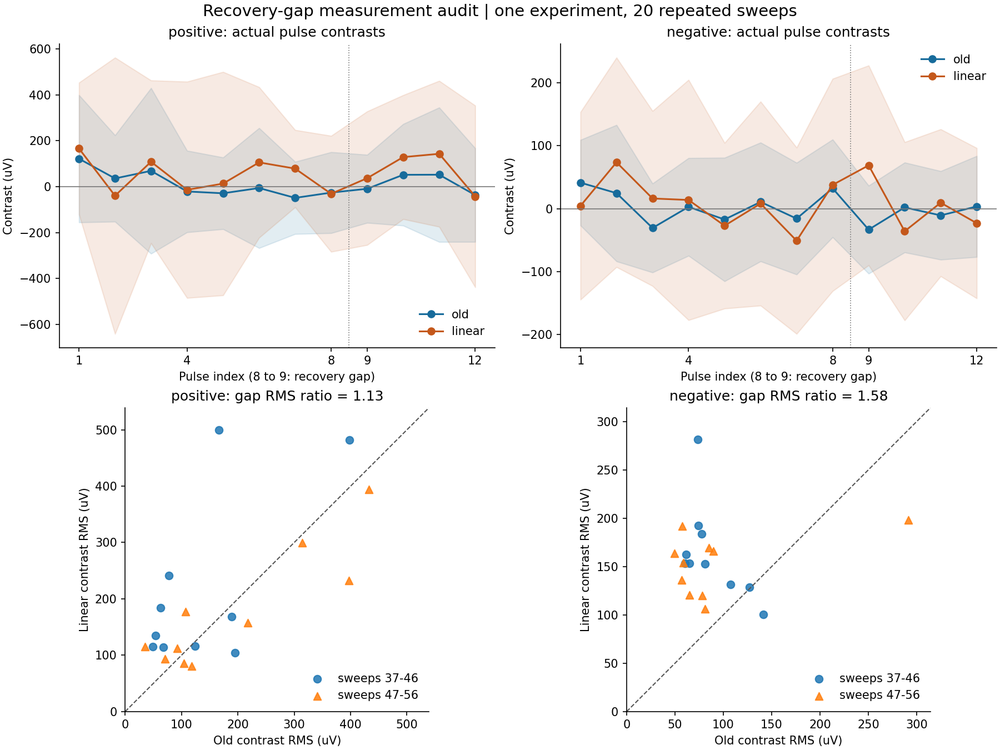

# Allen 회복간격: 잔류 파형과 기준선 외삽

2026-09-19. 질문은 **앞선 반응이 남은 창에서, 자극 전 기울기만으로 기준선을
외삽하면 측정이 안정되는가**다. 기존 반응·기준선 분해·초기 기준창 대조는 보존했다.
이번 결과는 실제 전압의 측정 진단이며, 시냅스 진폭의 정답이나 가소성 추정이 아니다.

## 자료와 비교

Allen SynPhys r2.1, 실험 `1574292898.139`의 보유 캐시를 재사용했다. source cell
18952/device 5, positive target 18951/device 4, negative target 18950/device 2다.
positive/negative는 기존 표적 명칭이며 전압의 부호가 아니다. 37–56의 20시행,
각 12자극, 두 표적의 480반응을 전부 포함했다. 같은 세포의 반복 측정이므로 480개의
독립 생물 표본으로 해석하지 않는다. 새 다운로드나 결과에 따른 시행 제외는 없다.

각 source 발화의 최대 기울기 시점에 맞춰 기존 창을 그대로 사용했다.

\[
 W_-=[-8,-3)\ {\rm ms},\qquad W_+=[2,8)\ {\rm ms}.
\]

기존 측정량은 $D_0=\bar V_+-\bar V_-$다. 자극 전 창에만 최소제곱 직선을 맞춘
기울기를 $\hat m$이라 두고, 후보를 다음과 같이 정의했다.

\[
 D_1=D_0-\hat m(\bar t_+-\bar t_-),\qquad
 \bar t_+-\bar t_-=10.5\ {\rm ms}.
\]

직선 기준선은 이 식에서 정확히 제거된다. 지수형 잔류 파형에는 곡률이 있으므로
정확한 제거가 보장되지 않는다. 이 연산은 막 시정수의 추정이나 역필터가 아니다.

대조 중심은 여덟 번째 source 발화 뒤 +20/40/60/80/100 ms다. 두 창을 포함하는
전체 구간이 여덟 번째 명령 펄스 종료 뒤, 아홉 번째 명령 시작 전에 있고 source
저장 명령은 0 A다. 20시행 × 두 표적 × 다섯 창 = 200개 대조 측정이다.
target DA2/DA4는 첫 자극부터 마지막 자극+150 ms까지 오프라인 NWB로 확인했다.
40/40개 채널 구간의 47,651표본이 모두 0 A였고, clock·단위·변환계수도 맞았다.
별도 holding 설정과 자발적인 신경 입력은 이 0 A에 포함되지 않는다.

## 결과: 이 외삽식을 기본 보정으로 채택하지 않음

RMS는 각 대조값의 제곱평균제곱근이다. 대조 구간의 생물학적 정답이 0이라고
가정하지 않으므로 예측오차나 진폭 추정 오차라고 부르지 않는다.

| 표적 | 시행 | 기존 RMS (µV) | 외삽 RMS (µV) | 외삽/기존 | 외삽 RMS가 작은 시행 |
|---|---|---:|---:|---:|---:|
| positive | 전체 37–56 | 204.592 | 231.707 | 1.133 | 9/20 |
| positive | 앞 37–46 | 171.729 | 258.896 | 1.508 | 3/10 |
| positive | 뒤 47–56 | 232.862 | 200.871 | 0.863 | 6/10 |
| negative | 전체 37–56 | 103.044 | 163.208 | 1.584 | 2/20 |
| negative | 앞 37–46 | 91.053 | 170.569 | 1.873 | 1/10 |
| negative | 뒤 47–56 | 113.778 | 155.498 | 1.367 | 1/10 |

앞/뒤 분할은 이미 본 시행의 기술적 안정성 점검이며 독립 보류 검증이 아니다.
positive의 뒤 절반에서만 집계 RMS가 작아졌다. 두 표적의 전체와 나머지 분할에서는
커졌으므로 이 자료에서 안정적인 보정이라는 근거가 없다. 기존 측정량을 진짜
시냅스 진폭으로 인정한다는 뜻도 아니다.

윗줄은 20시행 평균과 시행 간 표준편차이며 신뢰구간이 아니다. 아랫줄은 시행당
다섯 대조의 RMS를 비교한다. 대각선 위는 외삽 후 대조 변동이 더 큰 시행이다.

독립·등분산인 창 표본 잡음을 **가정하면** 기존 연산의 분산 계수는
$1/n_++1/n_-$이고 외삽은 다음 항을 더한다.

\[
 \frac{(\bar t_+-\bar t_-)^2}{\sum_{k\in W_-}(t_k-\bar t_-)^2}.
\]

500/600표본의 실제 창에서 이상적인 표준편차 비는 5.46494다. 짧은 창에서 얻은
기울기를 멀리 외삽하면 잡음을 키울 수 있음을 설명한다. 실제 전압의 시간 상관과
보간 공분산을 무시한 연산자 계산이므로 실제 잡음이 5.46배 늘었다는 주장은 아니다.

## 시간 지연, sin·cos 분해와 다음 판별

순수 지연의 항등식은 $I(t-\tau_d)\leftrightarrow
e^{-i\omega\tau_d}\widehat I(\omega)$다. 따라서 시간 영역에서 늦은 반응과 주파수
영역의 위상 차이는 연결된다. 휴지 전압을 뺀 수동 RC 막의 경우
$C\dot V+V/R=I$이고, 고정된 전달함수는 $H(\omega)=R/(1+i\omega RC)$다.
그 위상은 $-\arctan(\omega RC)$이며 모든 주파수에 동일한 시간 지연을 주는
필터는 아니다. [수동 막·합성곱·Fourier의 원 유도](https://neuronaldynamics.epfl.ch/online/Ch1.S3.html).

즉 고정 계수의 필터도 과거 입력의 흔적을 현재 전압에 남긴다. Fourier 표현의
sin·cos 성분이 각각 실제 신경 발진기라는 결론은 나오지 않는다. 다음 비교에서는
전체 시간 파형을 예측하는 고정 필터가 얼마나 설명하는지 먼저 확인하고, 남은
이력 의존성을 평가한다. 같은 현재 전압만 맞추어도 모든 숨은 상태가 같아지는
것은 아니므로 추가 예측력이 곧 가소성의 유일한 증거가 되지는 않는다.

이 자료의 입력은 source에 주입한 명령 전류이고 출력은 target 전압이다.
그 비율은 source 발화·전달·target 막·측정 장치를 함께 포함한다. 이를 단일
시냅스 전류나 target 막 임피던스로 바로 나누어 해석하지 않는다. 반복 50Hz의
짧은 파형만으로 지연과 여러 필터를 유일하게 식별했다고 주장할 수도 없다.
고정 필터와 이력에 따라 변하는 모형의 다음 비교는 독립적인 시간/자극 조건에서
파형 예측과 잔차를 함께 확인해야 한다. 기존 다른 실험의 20Hz 전이 실패도
[발화이력 원장](../paper/검증_원장/고정뉴런_발화이력_보류예측.md)에 그대로 남긴다.

## 검증과 산출물

- 480개 기존 반응 재현: 최대 절대 차이 `4.2170711367361946e-11 µV`.
- 관련 검사 8개 통과: 직선 제거, 알려진 post 반응 보존, pre만 사용,
  연산자 분산, 지수 곡률의 잔류, 잘못된 창 거부.
- notebook의 코드 셀 3개를 순서대로 실행해 오류가 없음을 확인했고, 생성 그림의
  단위·범례·시행 대응을 시각 검수했다. 그림은 notebook에 같은 바이트로 포함된다.
- 원자료 60개 NPZ 해시, 세 부모 JSON 해시, 40개 target 명령 및 source 대조 창 확인.
- 캐시 읽기는 해시 검증 오프라인 reader만 사용했다. 사용 블록 180개, 누락 0개.
  manifest SHA-256은 `dfea65157ac4bfc8af5aae0c08964b6c4258e631655d9cd17a3c4140ff06b15d`로 전후 같다.
- 결과 SHA-256: `b67236c43b795e0173530d8a9ee97380210c5499cc97c76e1397bcb572b3e13e`.

[새 측정 소스](../verify/Q-NPF-04/allen_synphys/recovery_baseline_extrapolation.py),
[검사](../tests/test_recovery_baseline_extrapolation.py),
[완료 결과](../verify/Q-NPF-04/allen_synphys/recovery_baseline_extrapolation_result.json),
[재현 notebook](../verify/Q-NPF-04/allen_synphys/recovery_baseline_extrapolation.ipynb),
[notebook 생성기](../verify/Q-NPF-04/allen_synphys/build_baseline_extrapolation_notebook.py).

실행은 보존된 `ce-agi-runtime-repro-fffd356/.codex/hooks/python.cmd`의
`pytest tests/test_recovery_baseline_extrapolation.py`와
`python verify/Q-NPF-04/allen_synphys/recovery_baseline_extrapolation.py`를 사용했다.
기존 출력이 있으면 실행기는 덮어쓰지 않으며 재분석은 `--output`으로 새 경로를 지정한다.
notebook 생성에는 같은 실행기를 `CE_PYTHON_WRAPPER`로 지정한다.
사용한 기존 notebook 의존성은
`C:/Users/dongh/AppData/Local/Temp/ce-malecns-notebook-deps-20260914`에 있고
`PYTHONPATH`로 연결했다. 측정 실행은 Python 3.11.9/NumPy 2.4.6,
notebook은 기존 Python 3.11.15 환경을 사용했다. 새 의존성 설치는 없다.
알고리즘 검사는 L0이고, 실제 기록에 대한 이번 진단은 학습·기억·리만 계량의
생물학적 검증으로 승격하지 않는다.

같은 날의 후속 [순방향 파형 비교](allen_recovery_waveform_findings.md)는 고정 필터와
효능 이력 후보를 실제 뒤 시행에 적용했다. 자유 오프셋에서의 약화 예측 개선과
오프셋 고정 시 회복 우위 소실을 구분해 보존했다. 이 문서의 직선 외삽 결과는 그대로다.
