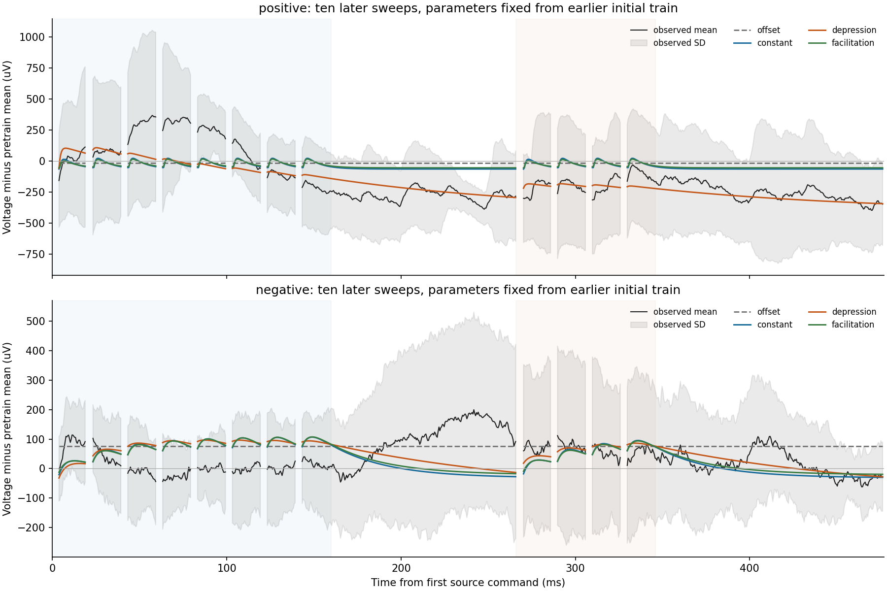
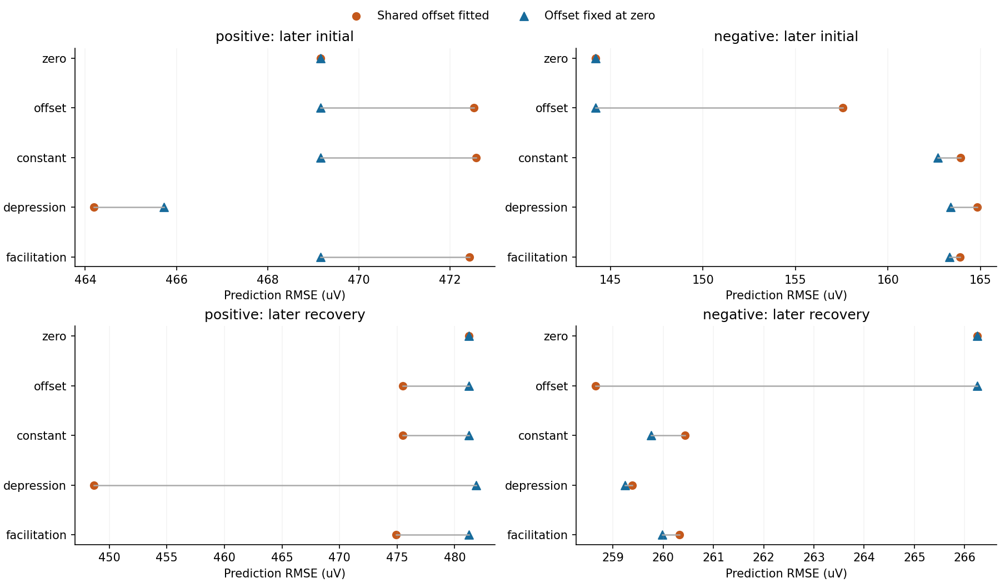
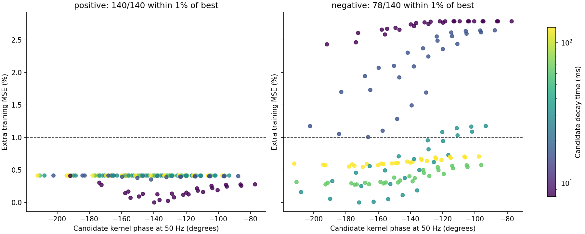

# Allen 회복 파형: 고정 필터와 이력 의존 효능의 구별

2026-09-19. **실제 파형 예측 완료 / 양성 표적의 약화 모형에 제한된 예측 개선 /
기준선 가정에 민감하여 가소성 기전과 위상 추정은 미확립.**

[직선 기준선 외삽의 불안정성](allen_recovery_baseline_extrapolation_findings.md)을 확인한 뒤,
이전 발화의 꼬리까지 포함하는 순방향 파형 모형을 비교했다. 목표는 고정 뉴런의 현재
전기 상태에 남은 흔적과 관계 자체의 변화를 구분하는 것이다. 기존 계산을 덮어쓰지
않았고 원자료 다운로드도 없었다. 결과를 본 뒤 기준선 감도검사를 별도로 수행했다.

## 1. 고정된 세포와 입력 적격성

실험 `1574292898.139`, source 18952/device5 → positive 18951/device4 및
negative 18950/device2다. DB의 pair104272는 흥분성 연결, pair104271은 보고된
시냅스가 없는 표적이다. negative라는 명칭은 억제성을 뜻하지 않는다. 두 표적에
같은 비음수 유효 반응 후보를 적용했고, 제작자의 지연·진폭 추정치는 적합에 쓰지 않았다.

37–56의 20시행은 첫 명령−100ms부터 마지막 명령+150ms까지 source 명령 12개,
대응 발화 12개, 추가 발화 0개를 확인했다. 기존 최대 기울기 발화 시각을 보존했다.
동일 clock·변환계수와 target의 저장 DA=0을 확인했다. 이는 별도 holding 설정과
생물학적 입력이 없다는 뜻이 아니다.

더 긴 회복 간격을 포함한 32–36도 보유 캐시만으로 조사했다. 표적 반응의 크기 대신
입력 관측 가능성과 자체 명령을 기준으로 포함·제외했다.

| 시행 | pulse8→9 onset 간격 | positive | negative |
|---|---:|---|---|
| 32 | 126.51ms | 포함 | target DA2 장구간 미보유 |
| 33 | 251.51ms | 포함 | target DA2 장구간 미보유 |
| 34 | 501.51ms | 포함 | target DA2 장구간 미보유 |
| 35 | 1001.50ms | source 장구간 미보유 | source·target 명령 장구간 미보유 |
| 36 | 4001.51ms | source 장구간 미보유 및 target 자체 입력 | source·target 명령 장구간 미보유 |

36의 positive에는 5.58301/5.60301/5.62301/5.64301s에 약 2.2nA, 1.51ms의
자체 명령 펄스 네 개가 있었다. source의 회복 자극은 5.97452s부터이므로 이 시행을
4초 동안 다른 입력 없이 회복한 대조로 취급하지 않았다. 누락 블록은 다운로드하지
않았으며 전체 누락량을 첫 실패 블록만으로 추정하지 않았다.

최종 포함은 43/50 표적-시행이다. 앞선 32–34 positive는 회복 간격마다 한 시행뿐이고
녹화 시간도 앞서므로, 간격의 인과 효과나 독립 확인 표본으로 해석하지 않는다.

## 2. 시간 영역과 위상 영역을 연결한 예측식

각 시행의 첫 자극 전 [−100,−10)ms 평균을 $V_{0s}$라 두었다. 예측식은

\[
 \widehat V_s(t)-V_{0s}=b+A\sum_nq_n h(t-t_n),\qquad A\ge0,
\]

\[
 h(u)=\frac{e^{-(u-\ell)/\tau_d}-e^{-(u-\ell)/\tau_r}}{Z}
       1_{u\ge\ell},\qquad 0<\tau_r<\tau_d,
\]

이다. $Z$는 단위 최대값 정규화다. source 발화에서 target 전압까지의 **유효 커널**이며
단일 시냅스 전류나 막 임피던스로 해석하지 않는다. 모든 이전 발화를 더하므로 파형
중첩을 포함한다. 원래 100kHz 표본 50개씩을 평균한 0.5ms 관측과 정확히 같은 표본
시각 평균을 예측에 적용했다. 명령 시작−0.5ms부터 source 발화+2ms와 겹치는 bin은
자극 부근의 인공 신호를 피하기 위해 모든 모형의 점수에서 뺐다.

고정 효능은 $q_n=1$이다. 약화·회복 후보는

\[
 q_1=1,\qquad q_{n+1}=1-[1-(1-U)q_n]e^{-\Delta t_n/\tau_q}
\]

를 사용했다. 이는 빠른 비활성화를 가정한 자원 모형의 축약이다.
[Tsodyks–Markram 원 논문](https://www.cns.nyu.edu/csh/csh04/Articles/Tsodyks-Markram-97.pdf).
촉진 후보는 $q_n=1+F\sum_{m<n}e^{-(t_n-t_m)/\tau_q}$인 현상론적 비교다.
각 시행 시작의 자원1·촉진0은 가정이며 직접 측정한 초기 상태가 아니다.

같은 고정 커널의 Fourier 변환은

\[
 H(\omega)=\frac{e^{-i\omega\ell}(\tau_d-\tau_r)}
 {Z(1+i\omega\tau_d)(1+i\omega\tau_r)},\qquad
 \phi=-\omega\ell-\arctan(\omega\tau_d)-\arctan(\omega\tau_r).
\]

따라서 사용자가 제안한 시간 차이와 sin·cos 위상의 연결은 이 예측식에 그대로
나타난다. 이 식은 선택한 지수 커널의 항등식이다. 실제 뇌에서 특정 위상을 측정했다는
주장은 아니다. 수동 필터와 합성곱의 대응은
[막 전기 모형의 원 유도](https://neuronaldynamics.epfl.ch/online/Ch1.S3.html)와 연결된다.

## 3. 적합과 예측을 분리한 범위

37–46의 첫 8자극 구간에서만 모형별 $b,A$, 커널, 효능 매개변수를 선택했다.
지연 7개 × 상승 시간 4개 × 감쇠 시간 5개 = 140개 커널과,
고정1·약화25·촉진20개의 효능 후보를 비교했다. 모든 후보는 같은 시행별 가중치와
같은 반응창을 사용했다. 정확한 격자는 [소스](../verify/Q-NPF-04/allen_synphys/recovery_waveform_prediction.py)와
[결과](../verify/Q-NPF-04/allen_synphys/recovery_waveform_prediction_result.json)에 있다.

47–56은 뒤 시행 예측이며 어떤 target 반응에도 gain·offset을 다시 맞추지 않았다.
첫 8자극, 자극 없는 회복 간격, 뒤 4자극, 마지막 꼬리를 구분했다. 보고된 RMSE는
각 시행 MSE를 같은 비중으로 평균한 뒤 제곱근을 취한 값이다. 시간 bin을 독립 생물
표본으로 세지 않았다. 이전 분석에서 이 파형들을 이미 보았으므로, 계산상의 적합
제외를 눈가림 확인 실험이라고 부르지 않는다.

비교의 필요조건은 이력 후보가 뒤 시행의 초기·회복 구간 **모두**에서 공통 오프셋
대조와 고정 효능보다 낮은 평균 MSE를 보이는 것이다. 이를 만족해도 숨은 전압 상태,
다른 입력, 측정 변화를 배제한 생물학적 기전 확인은 아니다.

## 4. 공통 오프셋을 허용한 결과

단위는 µV, 각 열은 뒤 10시행의 RMSE다.

| 모형 | positive 초기 | positive 회복 | negative 초기 | negative 회복 |
|---|---:|---:|---:|---:|
| 자극 전 전압 유지 | 469.154 | 481.250 | 144.193 | 266.254 |
| 학습한 공통 오프셋 | 472.519 | 475.507 | 157.572 | 258.653 |
| 고정 효능 | 472.566 | 475.471 | 163.917 | 260.432 |
| 약화·회복 | **464.190** | **448.671** | 164.836 | 259.384 |
| 촉진 | 472.429 | 474.921 | 163.897 | 260.328 |

positive 약화 후보는 고정 효능보다 초기 6/10, 회복 5/10시행에서 MSE가 작았다.
평균 개선과 모든 시행에서의 개선은 다르다. negative에서는 초기 영반응 대조가
더 좋았으므로 같은 이력 모형의 일관된 개선이 없었다.

positive의 추가 32–34 회복 구간에서도 공통 오프셋 약화 후보의 RMSE는
656.911µV로 고정 731.689µV, 영반응 744.992µV보다 작았다. 세 간격 각각에서 작았지만,
간격당 한 시행이고 34의 전체 변동이 커서 이 집계로 보편적 회복 법칙을 확정하지 않는다.

검은 선은 뒤 10시행 평균, 음영은 시행 간 표준편차다. 신뢰구간이 아니다.
자극 부근에서 빠진 bin과 초기·회복 구간을 표시했다.

## 5. 오프셋 감도검사에서 회복 우위가 사라짐

positive 약화 후보가 선택한 값은 $b=-413.328$µV, $A=516.880$µV,
$U=0.9$, $\tau_q=0.5$s, 지연1.5ms·상승1ms·감쇠128ms였다. 감쇠는 격자 상단이다.
자극 전 평균을 0으로 둔 뒤에도 큰 공통 음의 오프셋을 허용한 것이 결과를 좌우할 수
있어, 이 결과를 본 뒤 **$b=0$으로 고정한 별도 감도검사**를 수행했다. 동일 입력·분할·
격자·양의 진폭 조건에서만 다시 적합했다. 이전 결과는 보존했다.

| 모형/조건 | positive 초기 | positive 회복 | 추가 3간격 회복 |
|---|---:|---:|---:|
| 영반응 | 469.154 | 481.250 | 744.992 |
| 약화·회복, 공통 $b$ 적합 | 464.190 | 448.671 | 656.911 |
| 약화·회복, $b=0$ | 465.725 | **481.843** | **748.127** |

$b=0$에서 positive 고정 효능의 진폭은 0으로 선택됐다. 약화 후보는 초기에서만
작은 개선을 남겼고 회복에서 영반응/고정보다 나빴다. 회복 시행의 개선은 3/10,
추가 간격은 0/3이었다. 선택된 약화 계수도 $U=0.7$, $\tau_q=5$s, 감쇠16ms,
$A=107.487$µV로 바뀌었다. 회복시간은 새 격자 상단에 놓였다.

이는 자유 오프셋이 틀리거나 0 오프셋이 참이라는 증명이 아니다. **이력 효과의 크기와
기전 계수가 기준선 모형에 민감하다는 증거**다. 두 기준선 가정에 걸쳐 안정적인
회복 예측을 얻지 못했으므로 특정 자원 소모·회복시간을 이 연결의 생리값으로 채택하지 않는다.

각 패널의 가로축은 µV 단위 RMSE이며 범위가 다르다. 두 점은 같은 시행의 오차다.

## 6. 위상도 안정적으로 좁혀지지 않음

공통 오프셋을 허용한 positive 고정 커널은 140/140개 모두 최저 학습 MSE의 1% 이내다.
그 후보의 50Hz 위상은 −212.064°부터 −77.230°까지다. negative도 78/140개가
범위에 들어갔다. 1%는 단순한 격자 민감도 구간이지 신뢰구간이나 식별 불가능성의
수학적 증명이 아니다. 수치 최솟값 하나를 고를 수 있어도 이를 안정적인 실제 지연으로
해석할 근거가 부족하다. 진폭0으로 적합된 커널의 출력 위상은 정의되지 않는다.

## 7. 목표에 대한 판정과 다음 조건

고정 뉴런 ID, source 발화, target 전압의 이력을 같은 시간축에 연결했고, 고정 필터의
상태 기억과 효능 변화 후보를 실제 미래 구간에서 비교했다. 양성 표적의 공통 오프셋
모형에서는 제한된 예측 개선이 **지지됨**이다. 그 개선의 가소성 기전, 고유 위상,
실제 시냅스 전도도와 리만 계량 변화는 **미확립**이다. 관측 정보의 MaleCNS Fisher
증가를 이 전기 기록의 학습으로 합산하지 않는다.

다음에는 매개변수 격자를 넓혀 같은 전압 추세를 더 잘 맞추기보다, 자극 전·무명령
구간에서 느린 전압 상태의 예측을 먼저 교정해야 한다. 같은 인과적 기준선 상태 모형을
고정 효능·이력 효능에 공통으로 적용하고, 이미 본 데이터라는 계보를 보존하면서
새 조건의 예측을 비교한다. 추가 기록을 쓰면 전체 source 활동과 target 자체 입력을
확인한다. 이 측정 분리가 지지되기 전에는 전도도나 $g$에 적합 진폭을 대입하지 않는다.
장기 학습·해마의 검색 색인·행동으로 선택되는 현재 세계는 별도 관측과 검증이 남는다.

## 8. 검증·재현·산출물

- 파형 검사 9개, 오프셋 검사 3개 통과. 인과적 표본 평균·중첩·회복식·위상/군지연,
  적합에서 미래 반응 차단, 0 오프셋 회귀를 검사했다.
- 보유 NPZ 63개, 부모 JSON 5개와 NWB 블록 해시를 확인했다. 관측한 결손과
  자체 입력은 7개 제외 행에 보존했다. 기존 캐시를 변경하지 않았다.
- notebook 코드 셀 6개 순서 실행, 오류 0. 저장 배열에서 두 분석의 RMSE를 직접
  다시 계산했다. 그림 3개를 시각 검수하고 notebook 내 이미지와 해시가 같음을 확인했다.
- 이전 문서 검사 실패는 별도 기존 상태이며 이번 변경에 의한 새 실패는 없다.

[파형 결과](../verify/Q-NPF-04/allen_synphys/recovery_waveform_prediction_result.json)의 SHA-256:
`3d2137d5d728edf4d7f08efd3a8a280ffd7fa73ebda03a05f684ce25a6fbbad9`.
[오프셋 결과](../verify/Q-NPF-04/allen_synphys/recovery_offset_sensitivity_result.json)의 SHA-256:
`6ef15b489683e583dcc86ee34361deaabfa0587d4f40c09bb3e2de36e387569d`.
배열은 [파형 NPZ](../data/local/allen-synphys-analysis/recovery-waveform-v1/recovery_waveform_arrays.npz)와
[오프셋 NPZ](../data/local/allen-synphys-analysis/recovery-offset-sensitivity-v1/recovery_anchored_arrays.npz)에 있다.
[실행 notebook](../verify/Q-NPF-04/allen_synphys/recovery_waveform_prediction.ipynb)과
[생성기](../verify/Q-NPF-04/allen_synphys/build_recovery_waveform_notebook.py)를 함께 보존했다.

실행은 보존된 `C:/dev/ce/ce-agi-runtime-repro-fffd356/.codex/hooks/python.cmd`의
`pytest tests/test_recovery_waveform_prediction.py`, `pytest tests/test_recovery_offset_sensitivity.py`,
각 대응 소스의 `python` 실행을 사용했다. 분석은 Python3.11.9/NumPy2.4.6이다.
notebook은 앞 단계의 기존 Python3.11.15·외부 임시 의존성 경로와
`CE_PYTHON_WRAPPER`를 재사용했으며 새 설치는 없다. 모든 생성기는 기존 출력을 거부한다.

이번 저장소는 `C:/dev/ce/ce-agi-runtime`, 브랜치 main, upstream origin/main,
HEAD와 로컬 원격 추적 ref는 `fffd356`이다. 이 단계는 원격을 새로 fetch하지 않았고
커밋·push를 하지 않았다. 라이브러리 분리와 이전 연구의 다른 변경을 보존했다.

후속 [무명령 상태와 조건부 회복 예측](allen_causal_voltage_state_findings.md)은 quiet
앞 10시행만으로 기준선을 선택하고 동일한 관측 예산에서 고정·이력 효능을 비교했다.
양성 표적은 직전 전압 유지가 선택됐으며 뒤 시행 회복에서는 효능 후보들이 이 상태만의
예측보다 나빴다. 이전 target 관측을 허용한 별도 조건이므로 이 원장의 전체 파형 RMSE와
직접 비교하지 않는다. 이전 오프셋 결과는 보존하고 새로운 판정은 후속 원장을 따른다.
