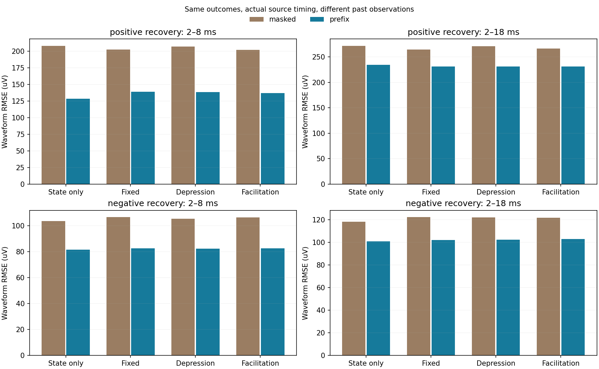
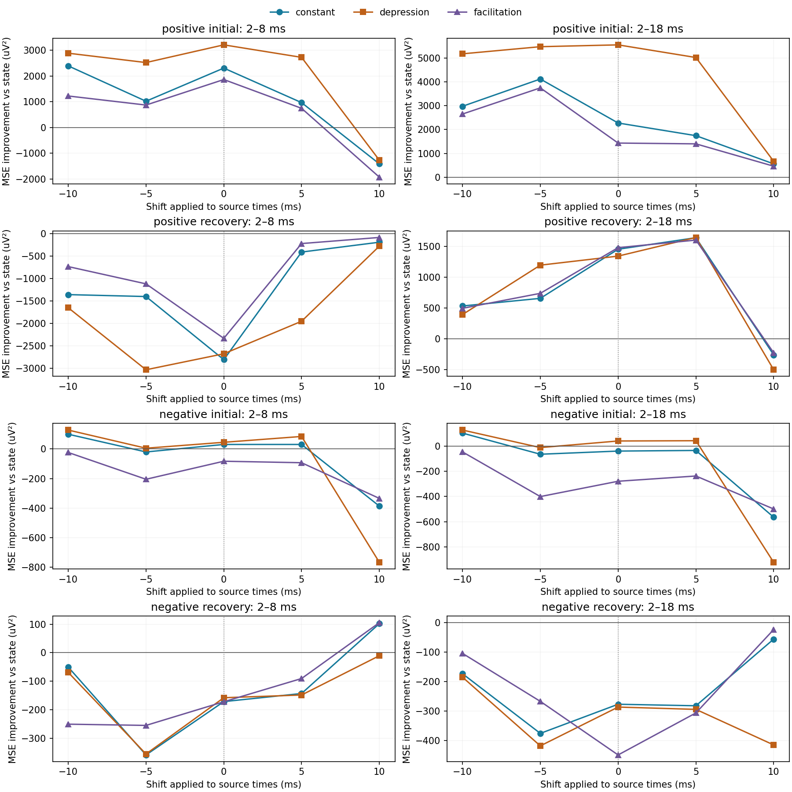
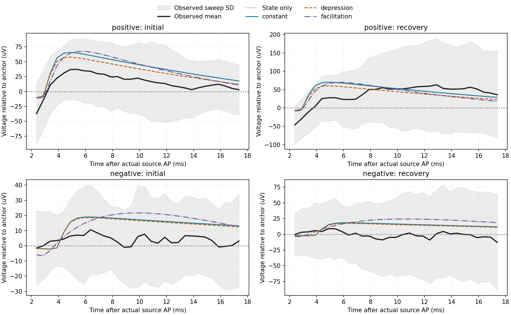

# Allen: 발화 시각·파형·관측 이력의 분리

2026-09-19. [앞 단계](allen_causal_voltage_state_findings.md)의 회복 평균 예측 실패가
짧은 파형을 평균내서 생긴 것인지, source에 시간 고정된 효과가 남는지 조사했다.
실제 target 표본과 기준선을 고정하고 예측에 쓰는 source AP 시각만 옮겼다.
이전 반응창을 모두 가리는 조건과 현재 반응 이전의 관측을 허용하는 조건을 각각
보존했다. 새 자료의 맹검이 아니라 같은 기록의 후속 탐색이다.

**양성 표적의 초기 파형에는 제한된 예측 이득이 남았으나, 회복 반응에서 고유 지연과
이력 효능은 안정적으로 식별되지 않았다.** 현재 관측을 충분히 허용한 짧은 회복
파형에서는 상태만 RMSE 128.303µV, 약화 후보 138.330µV였다. 18ms까지 넓히면
약화 후보가 상태보다 조금 나았지만 고정 효능보다 나빴고, source를 5ms 늦춘
대조가 실제 시각보다 더 나았다. 이를 실제 전달 지연 5ms로 해석하지 않는다.

## 1. 입력과 기존 대조와의 차이

실험 `1574292898.139`, source 18952/ext6/AD9, positive 18951/ext5/AD8,
negative 18950/ext3/AD2의 부모 파형 배열을 재사용했다. source·target 명령 및
전체 source 활동 확인에 따른 적격 43/50 표적-시행과 제외 7행을 그대로 보존했다.
부모·교정 결과, 그 소스·배열 해시를 대조했다. 새 다운로드나 캐시 수정은 없다.
positive의 기존 흥분성 라벨은 유지하며 negative를 억제성으로 바꾸지 않는다.

이전 `ic_matched_baseline_control`과 `train_quiet_controls`는 target 측정창을
무명령 구간으로 옮겼다. `recovery_baseline_extrapolation`은 긴 gap의 가상 사건에서
기준선 외삽을 비교했다. 이번에는 **target의 실제 표본·점수창·artifact 마스크는
유지하고, 커널에 들어가는 source 사건 시각만 −10, −5, 0, +5, +10ms 이동**한다.
각 조건은 처음 10시행(37–46)의 초기 8반응으로 독립 적합하고 뒤 10시행(47–56),
회복 4반응과 입력이 확인된 별도 간격 32–34 positive는 적합에서 제외한다.

| 점수창 | 사건당 완전한 0.5ms bin | 516사건 총 bin | 표적별 학습 80사건 bin |
|---|---:|---:|---:|
| AP+[2,8]ms | 11 | 5,676 | 880 |
| AP+[2,18]ms | 31 | 15,996 | 2,480 |

AP가 격자와 정렬되지 않으므로 경계에 걸친 bin은 제외했다. 모든 완전 포함 bin은
부모 artifact 검사를 통과하며 다음 command와 겹치지 않는다. 18ms 끝부터 다음
command까지 최소 여유는 0.640ms다. 두 창은 별도 적합·별도 평가이며 한 창의
성적을 보고 다른 창의 결과와 합쳐 최적 모형으로 만들지 않는다.

## 2. 관측 이력을 가리면 생기는 기준선 문제

첫 구현은 모든 AP+[2,18]ms를 기준선 갱신에서 가렸다. 다음 command의 0.5ms guard까지
적용하면 사용 가능한 완전한 bin이 없는 경우가 있다. 516사건 중 193개는 마지막
관측이 AP보다 20ms 이상 오래됐고 최대 102.095ms였다. 따라서 이 결과만으로
source 이력 효과를 채택하면, 실제로 관측 가능한 최근 전압을 빠뜨린 효과가 섞인다.

별도 후속 파일에서는 **현재 반응 이전의 모든 parent-valid 전압**을 허용했다.
이전 반응도 이미 관측한 뒤라면 다음 반응의 기준선에 쓸 수 있다. 자기 반응의
첫 점수 bin 이후 값은 자기 예측에 전혀 들어가지 않는다. 같은 193개 사건의
anchor가 바뀌었고, 최대 나이는 2.455ms로 줄었다. 두 창의 anchor는 사건별로 같다.
86개 표적-시행-창의 target 인덱스·pulse 라벨·관측값은 두 분석에서 정확히 같다.
이것은 동일 자료의 관측 예산 감도이며 두 독립 검증이 아니다.

| 현재 AP에서 본 마지막 관측의 나이 | 모든 과거 반응도 차단 | 이전 관측 허용 |
|---|---:|---:|
| 중앙값 ms | 2.145 | 2.015 |
| 최댓값 ms | 102.095 | 2.455 |
| 20ms 초과 사건 | 193/516 | 0/516 |

두 새 분석에서는 첫 command 이전에도 guard를 정확히 적용해 마지막 pre bin을
[−1.0,−0.5]ms로 둔다. 앞 causal 코드의 `(left<0)|valid`는 [−0.5,0]ms까지 복원했다.
이는 첫 guard의 구현 차이이며 미래 반응 누출은 아니다. 과거 소스·결과는 보존하고
그 기술상의 예외를 앞 원장에 명시했다. 새 결과를 과거 적합의 완전한 재현으로 쓰지 않는다.

## 3. 파형 예측식과 시간 이동 대조

점수 표본을 $t$, 그 사건의 마지막 허용 관측을 $a$, 이동한 source 시각과 효능
이력으로 만든 단위 진폭 파형을 $x_{\theta,s}$라 두면

\[
 \widehat V(t)=V(a)+A\{x_{\theta,s}(t)-x_{\theta,s}(a)\},\qquad A\ge0.
\]

즉 이전 파형의 꼬리를 기준선과 점수창에 일관되게 반영한다. 각 bin은 원래 100kHz
표본 50개의 평균이고 커널도 같은 표본 격자에서 정확히 평균낸다. 기존 140개
차분 지수 커널과 46개 고정·약화·촉진 후보를 사용하고 자유 오프셋을 추가하지 않는다.
적합 목적함수는 시행·사건에 같은 가중치를 준 전체 파형 MSE다.

같은 예측 오차 $e_{pk}$의 전체 파형 오차와 사건 평균 오차는 다음처럼 구분한다.

\[
 \frac1P\sum_p\frac1{n_p}\sum_k e_{pk}^2
 =\frac1P\sum_p\bar e_p^2
 +\frac1P\sum_p\frac1{n_p}\sum_k(e_{pk}-\bar e_p)^2.
\]

평균은 마지막 항을 버린다. 이번에는 두 항을 모두 저장했으며 평균용 모형을 따로
재적합하지 않았다. 음수 시각 이동은 미래 source AP를 앞당겨 쓸 수 있으므로 비인과적
시간 대조다. 뒤 시행에서 가장 좋은 이동을 골라 실제 모형으로 채택하지 않는다.
50Hz의 주기 alias, 이동과 fitted lag의 상쇄가 있어 고유 지연이나 permutation p값도
계산하지 않는다. 대조가 실제 source 시각보다 좋은 경우 역시 주 결과다.

## 4. 현재 이전 관측을 허용한 실제 시각의 결과

아래는 뒤 10시행의 전체 파형 RMSE, 단위 µV다. 모든 후보는 같은 전압·기준선·
점수 표본을 사용한다. 이 표의 행은 각자 별도 점수창이며 창 사이 RMSE를 순위화하지 않는다.

| 표적·창·구간 | 상태만 | 고정 효능 | 약화 | 촉진 |
|---|---:|---:|---:|---:|
| positive 2–8ms 초기 | 235.737 | 230.793 | 228.829 | 231.755 |
| positive 2–8ms 회복 | **128.303** | 138.804 | 138.330 | 137.084 |
| positive 2–18ms 초기 | 313.865 | 310.219 | 304.883 | 311.574 |
| positive 2–18ms 회복 | 234.131 | 231.012 | 231.254 | 230.957 |
| negative 2–8ms 초기 | 80.302 | 80.115 | 80.024 | 80.819 |
| negative 2–8ms 회복 | **81.507** | 82.553 | 82.470 | 82.556 |
| negative 2–18ms 초기 | 99.903 | 100.094 | 99.691 | 101.287 |
| negative 2–18ms 회복 | **100.892** | 102.252 | 102.299 | 103.089 |

양성 초기에서 약화 후보는 상태보다 짧은 창 7/10, 긴 창 8/10시행에서 낮은 MSE를
냈고, 이 후보의 초기 구간은 다섯 시간 대조 중 실제 시각이 가장 낮았다. 따라서
**정해진 후보군의 초기 양성 파형에 대한 제한된 예측 이득은 지지됨**으로 보존한다.
이것만으로 실제 시냅스 가소성의 기전이나 유일한 source 지연을 식별하지 않는다.

짧은 양성 회복에서는 약화가 상태만을 이긴 시행이 4/10이고 전체 오차도 더 크다.
사건 평균 RMSE 역시 상태만 112.939µV, 약화 125.319µV이므로 파형 정보를 보존해도
이 조건의 회복 우위는 나타나지 않는다. 긴 회복에서는 약화가 상태보다 작지만
고정보다 조금 크고, source +5ms 대조가 실제 시각보다 MSE 303µV² 작았다.
고정·촉진도 긴 회복에서 +5ms가 실제 시각보다 나았다. 짧은 회복의 실제 시각
고정 모형은 모든 비영 이동보다 나빴다. 초기와 회복의 시간 선호가 일치하지 않는다.

음성 표적에서는 작은 초기 이득이 있더라도 실제 시각의 회복 모형들이 모두 상태만보다
나빴다. 총 MSE 개선과 개선 시행 수의 방향이 다를 수 있어 두 값을 함께 보존한다.
일부 큰 오차 시행에 따라 평균 방향이 달라지며, 시행 수를 독립 동물 수로 세지 않는다.

## 5. 관측 정책에 따라 이력 계수도 달라짐

과거 반응을 가린 양성 짧은 창의 약화 회복시정수는 탐색 상한 5s였으나, 이전 관측을
허용하면 하한 0.05s가 선택됐다. 같은 target 파형에서도 관측 정책에 따라 100배
다른 격자값이 선택된 것이다. 긴 창도 5s에서 0.15s로 달라졌다. delay·rise·decay의
여러 값도 경계다. 한 최적값을 실제 자원 회복의 생리값으로 채택할 근거가 부족하다.

입력을 확인한 다른 회복 간격 3시행에서는 이전 관측 허용·실제 시각의 회복 RMSE가
짧은 창 상태 129.604/고정 116.161/약화 114.160/촉진 117.281µV,
긴 창 151.737/142.272/138.283/143.779µV였다. 약화는 긴 창에서 고정·상태보다
3/3시행 모두 작았다. 그러나 간격마다 한 시행이고 이미 검토한 자료다. 이 긍정 결과를
뒤 10시행의 다른 실패와 합쳐 보편적 회복식으로 확정하지 않는다.

그림은 표시를 위해 사건마다 31개 native bin의 순서를 맞춰 시행별 평균을 낸 것이다.
x는 실제 상대시각의 평균이며 보간은 없다. 음영은 시행 평균 파형 사이 SD이지 신뢰구간이
아니다. 실제 오차 계산에는 원래 시각과 모든 bin을 썼다. 양성 회복의 초기 음의 변위와
후반 상승을 단일 양의 커널이 완전히 설명하지 못하며, 관측 모양만으로 그 원인을
억제성 입력·기록 artifact·새 기억 상태 중 하나로 확정하지 않는다.

## 6. 목표에서의 위치와 다음 조건

이번 단계는 현재 전압의 정보, source 사건의 시각 정보와 효능 이력식을 같은 관측
조건에서 분리했다. 파형을 평균내는 문제만으로 앞 실패를 설명하기 어렵고, 허용한
과거 관측 자체가 이력 모형의 파라미터와 우위를 바꾼다는 근거를 얻었다.
고정 뉴런의 상태 기억과 관계 변화는 계속 구별해야 한다. 식별되지 않은 파형 진폭을
전도도나 리만 계량에 대입하지 않으며, 학습 전후 관계·독립 출력분포·비용의 공동
측정 없이 계량 변화로 승격하지 않는다. 해마의 주소 지정과 행동적 현재 선택도
이 단기 기록의 개선으로 대신 증명하지 않는다.

다음은 같은 50Hz 기록의 지연 격자 확대가 아니라 **보유 자료에서 입력·작동점이
확인된 다른 빈도 또는 전류 관측 조건을 찾아, 고정 전달 파형과 효능 이력을 구별하는
식이 전이되는지 확인**하는 것이다. 실험 `1630015960.701`의 기존 20Hz 전이 실패는
[이미 완료된 결과](../paper/검증_원장/고정뉴런_발화이력_보류예측.md)로 유지하며 미시도처럼
다시 제안하지 않는다. 새로운 조건을 쓰기 전에 source 활동·target 자체 명령·clamp
mode·holding 및 접근저항 관련 측정 경계를 확인한다. 새 자료가 필요하면 원장을 먼저
찾고 구체적 결손에 대해서만 받는다.

보유자료 조사에서는 다음 입구를 좁혔다. 같은 실험의 0–6시행은 20Hz 프로토콜이지만
[intrinsic 메타데이터](../verify/Q-NPF-04/allen_synphys/same_cell_intrinsic_inventory_result.json)와
[raw 식별 기록](../verify/Q-NPF-04/allen_synphys/raw_identity_result.json)에 따르면 세 acquisition이
모두 VC 전류(A), 세 command가 VC 전압(V)이다. 별도 source Vm/AP 채널은 없다.
source holding은 −70.02mV, Rs compensation off, 명령은 60mV·20Hz 8펄스 후
250ms 간격과 4펄스다. 이 경로의 다음 단일 명제는 **source voltage command에 잠긴
target clamp-current가 같은 시행의 무명령 대조를 넘는가**다. AP 발생·시각이나 순수
PSC를 이미 관측했다고 쓰지 않는다. IC 50Hz와 VC 20Hz의 차이를 빈도 효과로 직접
비교할 수도 없다. 대응하는 source/target/command 묶음 NPZ는 아직 원장에서 확인되지
않았으므로 오프라인 NWB 캐시의 범위 충족과 target 명령·access 정보를 먼저 검사한다.

비교 후보 `1630015960.701`의 같은 pair VC 0–9시행은 네 전류·명령 채널 NPZ가
이미 등록돼 있고, [기존 VC 분석](../verify/Q-NPF-04/allen_synphys/next_donor_vc_response_result.json)과
[평균 파형 재현](../verify/Q-NPF-04/allen_synphys/producer_vc_average_reconstruction_v2_result.json)도
끝났다. −70mV 53/60, −55mV 57/60 반응이 무명령 대조 범위 안이었다. 이는 새
발견 후보보다 leak/access 측정 경계의 재검토 대조로 유지한다. 이 자료가 존재한다는
사실만으로 실제 막전압·직렬저항·공통 회로를 유일하게 분리하지는 못한다.

## 7. 검증·재현·산출물

- source-time 검사 9개, observed-prefix 검사 4개 통과. 미래 반응 차단, 첫 guard,
  두 창의 공통 anchor, 정확한 시간 이동, 파형 오차 분해, 제외 결과에 대한 적합
  불변성 및 합성 커널 회수를 확인했다. 과거 반응이 이후 예측에만 쓰임도 검사했다.
- 통합 notebook 코드 셀 5개 순서 실행, 오류 0. 배열에서 시행별 6,880행의
  파형·평균·모양 MSE와 bias, 그룹 800행의 RMSE를 재계산했다. PNG 3개 시각 검수와
  외부·내장 이미지 바이트 일치를 확인했다.
- [관측 제한 소스](../verify/Q-NPF-04/allen_synphys/recovery_source_timing.py)와
  [검사](../tests/test_recovery_source_timing.py),
  [결과](../verify/Q-NPF-04/allen_synphys/recovery_source_timing_result.json),
  [배열](../data/local/allen-synphys-analysis/recovery-source-timing-v1/source_timing_arrays.npz).
- [이전 관측 허용 소스](../verify/Q-NPF-04/allen_synphys/recovery_source_prefix.py)와
  [검사](../tests/test_recovery_source_prefix.py),
  [결과](../verify/Q-NPF-04/allen_synphys/recovery_source_prefix_result.json),
  [배열](../data/local/allen-synphys-analysis/recovery-source-prefix-v1/source_prefix_arrays.npz).
- [실행 notebook](../verify/Q-NPF-04/allen_synphys/recovery_source_timing.ipynb)과
  [생성기](../verify/Q-NPF-04/allen_synphys/build_source_timing_notebook.py).

관측 제한 결과 SHA-256은 `a8a571ce64c61f507262e07de822464488d5a50b102ad76759d57212b5e0ef52`,
이전 관측 허용 결과는 `284c5a3d98f8e414459f9160f9dc9da7a0d1c16968458c24226bd1cc1452a9ad`다.
배열 SHA는 각 JSON에 있으며 소스·검사·부모 계보와 함께 고정한다.

실행기는 `C:/dev/ce/ce-agi-runtime-repro-fffd356/.codex/hooks/python.cmd`다.
`pytest tests/test_recovery_source_timing.py`, `pytest tests/test_recovery_source_prefix.py` 및
각 분석 소스의 `python` 실행을 한 번씩 수행했다. Python3.11.9/NumPy2.4.6을 썼고
notebook은 기존 Python3.11.15·외부 임시 의존성을 재사용했다. 생성기는 기존 출력
덮어쓰기를 거부한다. 전체 테스트·벤치마크·배포는 수행하지 않았다.

저장소 `C:/dev/ce/ce-agi-runtime`, main, upstream origin/main, HEAD와 로컬 원격 추적 ref는
`fffd356ee4f1f7bf5079f3379cd06e4dc56a444c`다. 새 fetch·커밋·push는 없으며 라이브러리
분리 및 이전 연구의 다른 변경을 보존했다.

## 20Hz VC 캐시의 실제 읽기 범위

2026-09-19 후속 오프라인 점검에서 `allen_joint_inventory.OfflineRanges`로 0–6시행을
확인했다. AD9·AD8·AD2는 각각 505,902표본, 100kHz 전류 기록이며 21개 전체 배열은
모두 결손 블록 때문에 완전히 읽히지 않았다. acquisition payload의 알려진 결손은
서로 다른 64KiB 블록 133개다. DA5·DA4 명령은 각각 7/7 읽혔고, DA2는 0시행만
읽혔다. DA2의 1–6시행은 metadata 블록 6개부터 없어 전체 필요 범위는 아직 불완전하다.
따라서 현재 알려진 최소 결손은 139개 블록이며, 이 수를 최종 다운로드량으로 보지 않는다.

등록된 `selected_pulse_windows.npz`는 0–4시행 HS5→HS4의 12펄스 주변 ±10ms만
담고 있다(SHA-256 `bcfdbdba77302dd5ff64d504f959b6093c2e815e493408a83bedaad89efb1571`).
HS2, 뒤 2시행, 전체 파형이 없어 위 결손을 대체하지 못한다. 캐시의 1,386개 블록과
90,818,568바이트는 그대로 두었고 다운로드하지 않았다.

각 세포의 명령 epoch는 순차적이며 HS2 뒤 HS4가 1003.01ms, HS5가 2006.02ms
늦게 시작한다. metadata상 source HS5의 5–6시행 명령 진폭은 120mV, HS4 자체
epoch의 명령 진폭은 150mV여서 모든 시행을 동일한 60mV 입력으로 취급하지 않는다.
NWB holding과 test-pulse 설정은 확인했지만, 0–6시행별 access/input resistance의
DB 결합값은 미확인이다. 다음 진행은 metadata 결손을 먼저 해소해 필요한 범위를
확정하고, 실제 명령·test-pulse 상태를 확인하는 것이다. source Vm/AP 부재에 따른
command-locked clamp-current 해석 경계는 유지한다.

후속 [20Hz 전체 입력 확보](allen_vc20hz_inputs_findings.md)에서 이 결손139블록을
별도 overlay에 받아42개 전류·명령 배열을 완성했다. 앞의 결손 판정은 수집 전 상태이며,
현재 남은 입력 경계는 시행별 access/QC의 DB 결합이다. 실제 진폭과 검증은 후속 원장을 따른다.
