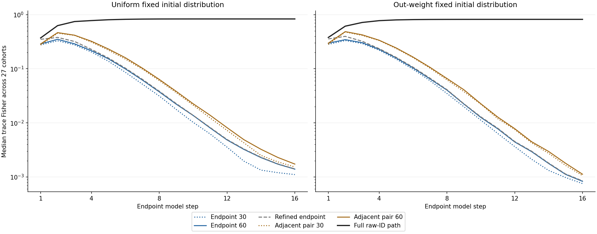
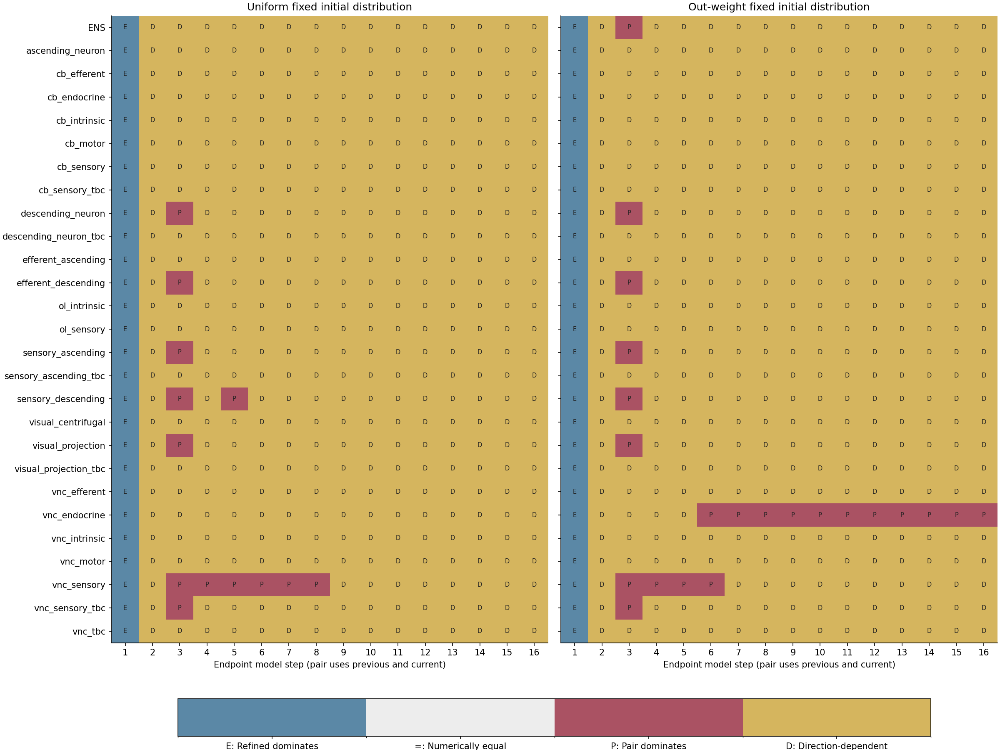

# 10. 직전 관측이 연결 변화의 구별성에 더하는 것

## 10.1 현재를 자세히 보기와 과거를 함께 보기

앞 장은 같은 연결 변화를 어느 시점에서 얼마나 자세히 관측하는지에 따라 Fisher 정보가
달라짐을 보였다. 그러나 현재 상태의 해상도를 높이는 것과 과거 관측을 더하는 것은
다른 선택이다. 현재 raw ID를 알더라도 그곳에 도달한 경로는 모를 수 있고, 두 시점의
범주를 알더라도 현재 raw ID는 모를 수 있다. 이 장은 이 차이를 같은 확률 모형과
같은 효능 좌표에서 비교한다. 시간별 endpoint 정보를 독립 표본처럼 더하지 않는다.

입력은 앞 장의 전체 MaleCNS 전이, 고정 초기분포 54개, 세 공유 log-efficacy 좌표다.
Active target, same assigned superclass, reciprocal nonself의 정의와 겹침을 유지한다.
Source 공통 배수의 네 번째 좌표도 계속 영방향이다. 범주는 해부학적 ROI가 아니며
모든 raw segment를 확정 뉴런으로 간주하지 않는다. 모델 step은 신경 시간 단위가 아니다.

## 10.2 두 시점의 정확한 결합 관측

관측의 차이를 비교하려면 우선 두 시점을 함께 본 확률을 구성해야 한다. [정의] $Y_t$는
시점 $t$의 active category 30개와 terminal category 30개를 구별하는 60출력이다.
인접 관측쌍은 $(Y_{t-1},Y_t)$이며 최대 3,600개의 결과를 가진다. 이것은 모든 과거를
기록한 이력이 아니라 움직이는 두 시점 창이다. Step 0에서는 같은 초기 관측을 두 번
놓고, step 1부터 실제 직전·현재의 결합을 사용한다.

앞 장과 같이 active 확률을 $a_t$, 누적 terminal 확률을 $b_t$, 두 전이를 $A,B$,
active category 합산을 $O$라 한다. [정의] $S=[OA;B]$는 raw active source 하나에서
다음 60출력으로 가는 전이이며, $c(j)$는 source ID $j$의 active category다. 직전
관측이 active category $c$이고 현재 결과가 $d$인 결합확률은

$$
q_t(c,d)=\sum_{j:c(j)=c}a_{t-1,j}S_{dj}.
$$

직전부터 terminal category $c$에 있던 질량은 $q_t(30+c,30+c)$에 $b_{t-1,c}$만큼
더한다. 공급한 흡수 경계 때문에 이 질량은 다른 칸으로 이동하지 않는다. 모든 raw
source의 $a_{t-1}$를 사용하므로 범주 평균 전이를 곱한 자율 Markov 근사가 아니다.

전체망에서 같은 계산을 수행하려고 [정의] 희소 읽기 행렬 $W$를
$W_{60c(j)+d,j}=S_{dj}$로 둔다. 곱 $Wa_{t-1}$를 60×60으로 펴면 active 부분의
결합확률이다. 여기에 앞의 terminal 대각을 더한다. $W$의 비영 원소 수는
source와 관측쌍의 압축 셀 수이지 원래 연결 수가 아니다.

결합확률의 미분도 원래 연결에서 시작한다. 앞 장의 feature 가중 전이를
$F_k^A,F_k^B$, source 평균을 $\mu_k$라 하고, $[OF_k^A;F_k^B]$를 같은 인덱스로
옮긴 행렬을 $W_k$라 한다. $u_k=\partial_k a_{t-1}$, $v_k=\partial_k b_{t-1}$로
쓰면 active 부분의 결합 미분은 $W(u_k-\mu_k\odot a_{t-1})+W_ka_{t-1}$다.
Terminal 대각에는 $v_k$를 더한다. 특히 역방향 연결 여부는 범주만으로 결정되지
않으므로 먼저 raw 연결에 feature를 곱하고 나중에 합산한다.

이 구성의 직접 검사 조건은 두 주변분포다. $q_t$를 현재 축으로 합하면 직전 endpoint,
직전 축으로 합하면 현재 endpoint가 된다. 미분도 같은 합산 관계를 만족해야 한다.
두 시점에서 active/terminal flag를 각각 버리면 별도의 30×30 결합 관측을 얻는다.

## 10.3 증가분은 조건부 Fisher다

결합확률이 준비되면 직전 관측의 기여를 현재 정보와 분리할 수 있다. [정의] 결합
미분을 $J_t=\partial_\theta q_t$라 하고 양의 support에서
$G_{pair60}=J_t^\top\operatorname{diag}(1/q_t)J_t$로 둔다. 배열의 두 관측 축은
하나의 결과 축으로 펴서 계산한다. 확률 0인 항은 같은 support에서 미분도 0인지
확인하며 임의의 양수나 ridge를 더하지 않는다.

[정리: 직전 관측의 조건부 정보] 현재 endpoint의 확률을 $p_d=\sum_cq_t(c,d)$,
그 조건에서 직전 관측의 확률을 $r_{c|d}=q_t(c,d)/p_d$라 하면

$$
G_{pair60}-G_{endpoint60}
=\sum_{d:p_d>0}p_d G_\theta(Y_{t-1}\mid Y_t=d)\succeq0.
$$

증명. $q_t(c,d)=p_dr_{c|d}$를 로그 미분하면 결합 score는 현재의 score와 조건부
score의 합이다. 각 $d$에서 $\sum_c r_{c|d}\partial_\theta\log r_{c|d}=0$이므로
두 score의 교차 기댓값은 0이다. 제곱 외적의 기댓값을 취하면 현재 Fisher와
조건부 Fisher의 가중합이 남는다. 확률 0인 support의 항은 기여하지 않는다. □

따라서 증가분은 현재를 알고도 직전 관측에서 더 구별할 수 있는 효능 변화다.
상호정보량이나 생물학적 기억량이 아니며, 두 확률변수의 일반적인 통계적 의존 자체를
측정하는 것도 아니다. 선택한 좌표에 조건부 분포가 얼마나 민감한지를 본다.
각 초기 probe의 범주는 고정돼 있으므로 첫 step에서 직전 관측은 이미 알려져 있다.
이때 pair60과 endpoint60의 정보는 같아야 한다.

## 10.4 모든 raw 경로를 관측하는 비교 상한

직전 한 번의 관측이 전체 이력의 얼마를 보존하는지 보려면 더 상세한 비교 관측이
필요하다. [정의] $X_r$는 시점 $r$의 active raw ID 또는 terminal category이며,
full path는 $(X_0,\ldots,X_t)$다. 이는 기록 길이와 상태 해상도가 모두 더 큰 관측이다.
같은 예산의 압축 모형이나 실용 구현의 성능으로 해석하지 않는다.

고정 초기분포에서 한 전이의 score는 앞 장의 feature 벡터 $f$와 source 평균
$\mu_j$의 차 $s_r=f-\mu_j$다. Source $j$를 알고 나면 $E[s_r\mid j]=0$이다.
[정의] source별 전이 score 공분산을

$$
C_j=E[ff^\top\mid j]-\mu_j\mu_j^\top
$$

로 둔다. 세 feature가 겹칠 수 있으므로 대각뿐 아니라 모든 교차 성분을 계산한다.
관측으로 압축된 전이에서 feature를 다시 추측하지 않는다.

[정리: 고정 초기분포의 경로 정보] 같은 support의 전이에서

$$
G_{path}(t)=\sum_{r=0}^{t-1}\sum_j a_{r,j}C_j.
$$

증명. 경로 likelihood는 초기 확률과 조건부 전이 확률의 곱이다. 초기 확률은 좌표에
무관하므로 경로 score는 전이 score들의 합이다. 먼저 일어난 score는 뒤 전이 직전의
이력에 포함되고, 뒤 score는 그 이력에 조건부 평균 0이다. 따라서 서로 다른 시점의
교차 기댓값은 0이다. 각 시점에서 남는 score 외적을 source 방문확률 $a_{r,j}$로
평균하고 시간에 합하면 식을 얻는다. 흡수 뒤의 결정론적 반복은 score 0이다. □

이 식의 합은 전이 score 공분산의 합이지 endpoint Fisher의 합이 아니다.
일반적인 경로 민감도 배경은 [Arampatzis 등의 원문](https://arxiv.org/abs/1502.05430)을
참고한다. 여기서는 작은 raw 그래프의 경로를 모두 열거해 독립 검산한다. 실제 전체망의
모든 경로를 열거했다는 뜻은 아니다.

이번 feature는 source와 terminal category를 함께 고정하면 그 셀의 terminal raw
ID들에서 일정하다. 그러므로 직전 raw source까지 관측한 full path에서는 terminal
ID를 추가해도 세 효능 좌표의 score가 늘지 않는다. 직전 source가 범주로만 보이는
pair60이나 terminal endpoint에서는 이 결론을 사용할 수 없다.

## 10.5 비교 가능한 관측과 비교 불가능한 순서

경로 정보와 결합 정보가 정의됐으므로 관측을 버리는 순서만 확실하게 말할 수 있다.
같은 시점·초기분포·좌표에서 30출력 결합은 60출력 결합의 함수이고, 각 endpoint는
해당 결합의 함수다. 따라서 앞 장의 고정 관측 축약 부등식으로

$$
G_{endpoint30}\preceq G_{pair30}\preceq G_{pair60}\preceq G_{path},
\qquad
G_{endpoint60}\preceq G_{pair60},\quad
G_{refined}\preceq G_{path}
$$

를 얻는다. Endpoint에는 현재 또는 직전을 각각 대입할 수 있다. $G_{refined}$는
현재의 active raw ID와 terminal category만 관측한 정보다.

반면 pair60과 refined endpoint는 서로의 함수가 아니다. 둘의 차이 행렬에 양·음
고유값이 함께 있으면 효능 변화 방향에 따라 더 유리한 관측이 달라진다. Trace 한
개로 이 순서를 대신 판정하지 않는다. 또한 full path는 기록이 누적되므로 시간
증가분이 양의 준정부호지만, 인접 관측쌍은 오래된 관측을 버리며 이동한다. 따라서
pair Fisher의 시간 단조를 요구하지 않는다. 동일 feature를 사용하는 작은 그래프의
비교 불가와 비단조 반례를 관련 검사에 포함했다.

## 10.6 전체 입력에서 확인한 관측 차이

앞 절의 순서와 비단조 가능성을 실제 전체 연결에서 계산했다. [산출] 2026-09-19에
54개 초기분포·0..16 step의 결합확률, 미분과 여섯 관측의 Fisher 계산을 완료했다.
관련 검사 7개가 통과했고, 전량 결합 미분의 세 좌표·두 간격 독립 차분 최대 절대오차는
$3.1475\times10^{-10}$이었다. 주변분포·질량·영방향·Loewner 검사도 고정 기준을
통과했다. 입력·환경·해시·검증 범위의 정본은 [이력 정보 원장](../../../ledger/malecns_history_fisher_findings.md)이다.

첫 번째 관측은 직전 기록의 조건부 기여다. 초기 범주가 알려진 step 1에서는 pair60과
endpoint60의 정보가 허용오차 안에서 같았다. Step 2..16에서는 매 시점 54/54개 초기
조건에서 추가 Fisher의 trace가 $5\times10^{-9}$보다 컸다. 이 결과는 선택한 효능
좌표 중 적어도 어떤 방향의 구별성이 직전 관측으로 늘어남을 지지한다. 모든 방향에서
엄격히 늘어남이나 생물학적 기억량의 증가를 뜻하지 않는다.

마지막 step에서 현재 관측이 두 시점 관측의 trace 중 차지하는 비와, 두 시점 관측이
전체 경로 trace 중 차지하는 비를 각각 계산했다. 아래는 범주별 비의 중앙값과 범위다.

| 초기분포: 각 27범주 | 현재 / 인접 두 시점 | 인접 두 시점 / 전체 raw 경로 |
|---|---|---|
| 균등 | 0.718947 (0.596790–0.893312) | 0.00208149 (0.000571586–0.0182492) |
| outgoing 접촉수 가중 | 0.689637 (0.605891–0.906102) | 0.00222750 (0.000320110–0.00975165) |

이 trace 비는 고정한 세 log-efficacy 좌표와 그 스케일에서의 요약이다. 좌표 재표현에
불변인 비율이나 독립 동물의 신뢰구간은 아니다. 두 시점의 범주 관측은 현재만 보는
관측보다 많은 정보를 담지만, 처음부터 모든 raw 경로를 기록하는 관측에는 훨씬 못
미친다. 기록 해상도와 길이가 함께 달라지므로 같은 예산의 기억 압축 성능으로 읽지 않는다.

두 번째 관측은 현재 해상도와 시간 이력이 대체 관계가 아니라는 것이다. Step 1에서는
현재 raw ID를 보는 refined endpoint가 54/54에서 우세했다. Step 2에서는 54/54에서
pair60과 refined endpoint의 차이에 양·음 고유값이 함께 나타났다. Step 16에서는
pair60 우위가 1/54, 방향에 따라 우위가 바뀌는 경우가 53/54였다. 따라서 현재를 더
자세히 보는 방법과 과거를 더 보는 방법 중 하나가 언제나 우월하다는 순서는 성립하지 않는다.

마지막으로 모든 54개 초기 조건에서 이동 관측쌍 Fisher의 시간 증가분에 음의 방향이
한 번 이상 있었다. 이는 같은 시점에서 과거를 더 보는 이득과 모순되지 않는다.
이동 창은 오래된 기록을 버리기 때문이다. Step 2..16에서 여섯 관측 모두 세 구조
좌표의 수치 rank가 3이더라도 정보의 크기는 다르다. Rank, trace, 행렬 순서를
구분해야 하는 이유가 전체 입력에서도 확인됐다.

## 10.7 이 결과가 닫지 않는 질문

이 비교는 같은 정적 구조 위에 공급한 확률 전달에서 관측 선택의 효과를 구분한다.
구조 자료가 실제 MaleCNS라는 사실과 공급한 동역학의 결과는 증거 층이 다르다.
이번 통합 주장은 `BIO_EVIDENCE_L0`이며 실제 신경 이력·학습·가소성·물리공간의 계량을
측정한 것이 아니다. 모든 coarse history의 likelihood, 같은 총 예산에서의 확률 보존
축약, 새 입력과 대안 경계, 실제 ROI 및 기능 관측의 교정은 아직 남아 있다.

특히 이번 과거는 **관측자가 보관한 기록**이다. 신경계가 내부에 만든 흔적이나 학습으로
바뀐 시냅스 효능을 관측한 것이 아니다. 이 둘을 연결하려면 같은 현재 입력·관측에서
이력이 다른 준비의 다음 반응을 비교하고, 잔류 전기반응과 효능 변화도 구별해야 한다.
[다음 장](11_전기상태에서_기억과_계량까지.md)은 이 측정 다리를 포함해 전기상태,
가소성, 계량과 기억 검색을 하나의 조건부 구조에 놓는다.
